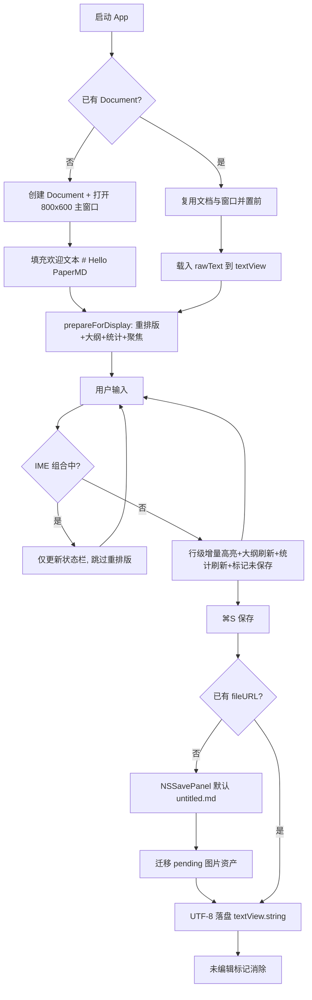
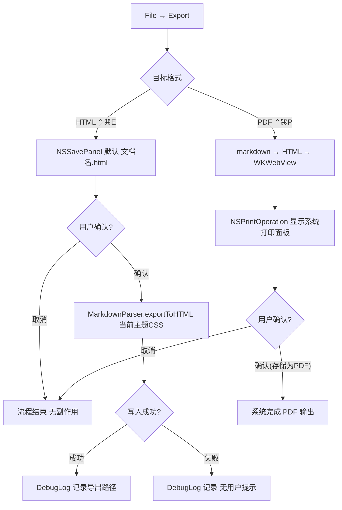
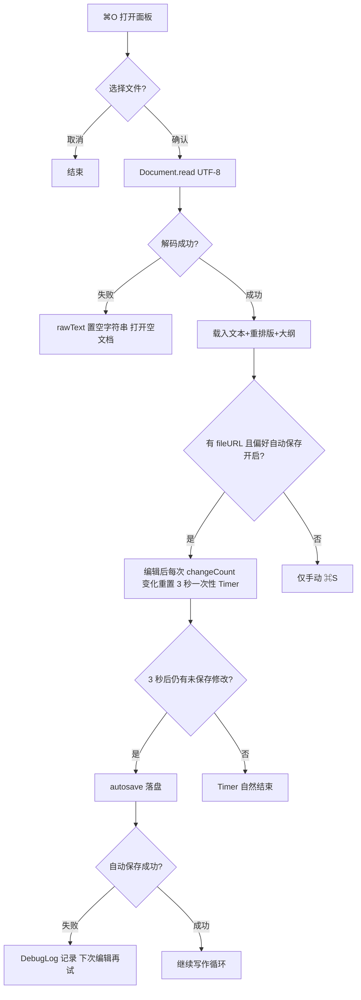
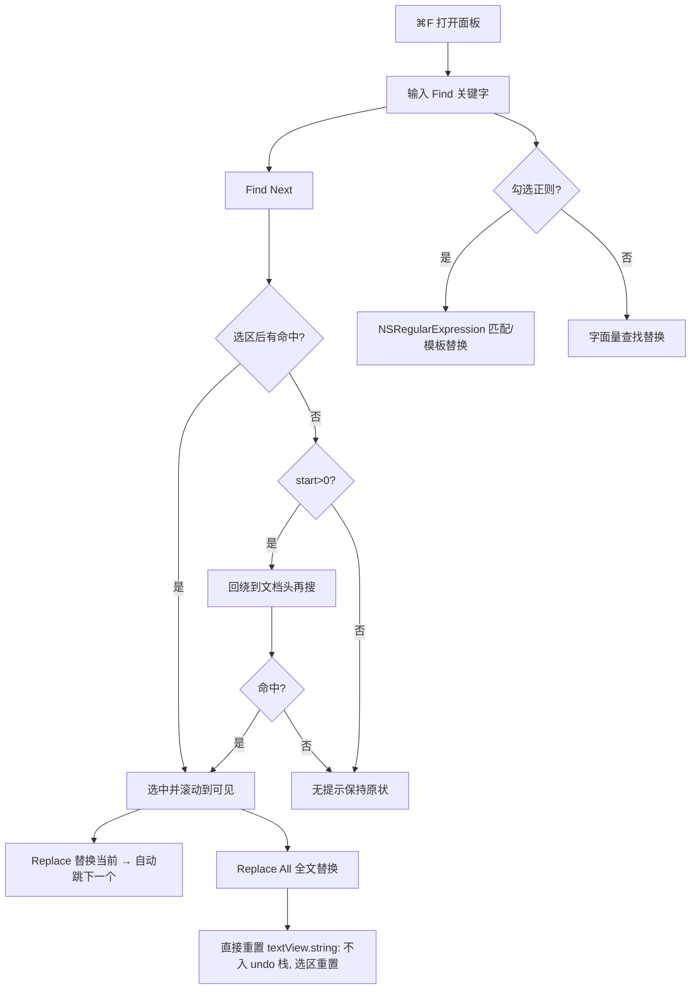

# PaperMD 旧项目逆向分析报告

> 版本：v1.0（对应 CHANGELOG 1.0.0 — 2026-06-10，含 v1.1 搜索替换等增量）
> 生成日期：2026-09-02
> 方法：全量阅读 PaperMD/ 源码、PaperMDTests/、PaperMDUITests/、Tests/、Scripts/、docs/、.github/workflows/、README.md、CHANGELOG.md、CLAUDE.md 及工程配置文件后如实还原。所有功能均标注来源文件；无法确认的标【未知】。

---

## ① 项目概述

### 1.1 产品定位（来源：README.md 第 20 行、CLAUDE.md "Project Overview"、docs/ROADMAP.md）

PaperMD 是一款专为 macOS 设计的原生 Markdown **语法高亮编辑器**，保留源码可见（`#`、`**` 等标记不隐藏），专注于极致的输入体验。适用于长文写作、文档编写和技术写作。

- 编辑模型：**单栏"带样式的源码"（styled source）**——Markdown 标记保持可见，语法高亮以属性叠加方式呈现；**不是** Typora 式隐藏标记的 WYSIWYG（CLAUDE.md "Edit model"）。
- 核心理念："输入零卡顿、光标行为 100% 可预测"，为不可妥协的 P0（CLAUDE.md "Core Philosophy"）。
- 本地优先：文件即文档，不引入私有格式（docs/产品说明.md 5.1.2）。
- v1 明确不做：云同步、协作、插件、AI 写作、账号体系（CLAUDE.md "Out of scope"、docs/产品说明.md 第 9 节）。

### 1.2 技术架构（来源：README.md 技术栈表、CLAUDE.md、main.swift、Info.plist）

| 组件 | 技术 | 证据 |
|------|------|------|
| 语言 | Swift | 全部源码 `.swift` |
| UI 框架 | AppKit（编辑器 100% AppKit，无 SwiftUI） | `PaperMD/App/*.swift` 全部 `import Cocoa`；CLAUDE.md "no SwiftUI in editor" |
| 文档架构 | NSDocument / Document-based App | `PaperMD/App/Document.swift`、`PaperMDDocumentController.swift` |
| 编辑引擎 | TextKit 1：NSTextView + NSLayoutManager + NSTextStorage | `EditorView.swift` L52-70 手工搭建 TextKit 1 管线 |
| 解析 | 行级增量（MarkdownParser / MarkdownFormatter） | `Core/MarkdownParser.swift`、`App/MarkdownFormatter.swift` |
| 撤销系统 | NSUndoManager（窗口级） | `MarkdownTextView.swift` L59-65、`Document.swift` L301-309 |
| 图片 | `{文档名}.assets/` + `` 源文本（禁 NSTextAttachment 替换源文本） | `App/ImageHandler.swift`、CLAUDE.md P0 规则 4 |
| 导出 | HTML（自渲染）+ PDF（WKWebView + NSPrintOperation 打印管线） | `App/ExportHelper.swift` |
| 启动入口 | 显式 `main.swift` 设置 delegate（移除 Main.storyboard 启动） | `App/main.swift` 注释 "required after removing Main.storyboard" |
| 沙盒 | App Sandbox 开启 + 用户选择文件读写权限；网络客户端关闭 | `Supporting Files/PaperMD.entitlements` |
| 最低系统 | macOS 12.0+（README）；Info.plist `LSMinimumSystemVersion=$(MACOSX_DEPLOYMENT_TARGET)` | README.md "系统要求" |
| 版本号 | CFBundleShortVersionString=1.0 | `Info.plist` |

注意：`Supporting Files/Main.storyboard` 仍打包于 Resources（project.pbxproj A100005），但运行时菜单被 `AppDelegate.fixMenuStructure()` 程序化整体重建（AppDelegate.swift L89-305），storyboard 菜单结构被注释为 "have structure issues"——遗留资产。

### 1.3 用户类型（来源：docs/产品说明.md 第 2 节）

- 核心用户：开发者（技术文档/README/设计说明）、内容创作者（教程/博客/公众号文章）、长文写作者（方案、文档、手册）。
- 非目标用户（v1 不满足）：实时多人协作、强笔记/知识图谱、强 AI 写作依赖用户。
- 输入体验以中文（IME）为一等公民（docs/产品说明.md 5.3.3、README 开发理念）。

### 1.4 核心价值（来源：README.md 核心特性、开发理念）

1. 原生 macOS 应用：AppKit 构建，性能与体验原生。
2. 语法高亮编辑：单栏编辑、实时高亮、非隐藏标记。
3. 智能编辑：自动列表续行、Tab 缩进、智能列表项终止。
4. 大纲视图：标题自动生成目录导航。
5. 专注模式：隐藏干扰（侧栏+状态栏+工具栏）。
6. 全键盘支持：所有操作有快捷键。
7. 纯文本粘贴：外部粘贴自动去格式。
8. 四条开发铁律：光标不因渲染跳动；自动格式化不移动光标；中文 IME 期间不布局重建；每个结构变更可撤销（README.md "开发理念"）。

---

## ② 项目结构分析

```
PaperMD/
├── PaperMD.xcodeproj/            # Xcode 工程（scheme: PaperMD）
├── PaperMD/
│   ├── App/                      # UI 层 + 应用层（全部 import Cocoa）
│   │   ├── main.swift            # 启动入口，显式挂接 AppDelegate
│   │   ├── AppDelegate.swift     # 菜单栏程序化重建、偏好/查找/导出入口、窗口保活
│   │   ├── PaperMDDocumentController.swift # NSDocumentController 子类（新建文档直开窗口）
│   │   ├── Document.swift        # NSDocument 子类：读写/保存/自动保存/窗口创建
│   │   ├── WindowController.swift# 窗口控制器 + NSToolbar（7 个工具项）
│   │   ├── EditorView.swift      # 主编辑视图：NSSplitView(大纲+滚动编辑区)+状态栏；格式化调度
│   │   ├── MarkdownTextView.swift# NSTextView 子类：智能列表键处理、纯文本粘贴、图片拖放、undo 拦截
│   │   ├── OutlineView.swift     # 大纲侧栏（NSTableView）
│   │   ├── StatusBar.swift       # 状态栏 + DocumentStats 统计模型
│   │   ├── PreferencesWindowController.swift # 偏好窗口 + Preferences（UserDefaults）
│   │   ├── SearchReplaceController.swift     # 查找替换面板（v1.1）
│   │   ├── ExportHelper.swift    # HTML 导出/落盘 + WKWebView 打印 PDF
│   │   ├── ImageHandler.swift    # 图片落盘/插入/迁移/撤销组
│   │   ├── MenuActions.swift     # 菜单动作辅助（反射取 textView；部分为备用路径）
│   │   └── MarkdownFormatter.swift # 语法高亮属性渲染（行级增量）
│   ├── Core/                     # 纯逻辑层（可测试）
│   │   ├── MarkdownParser.swift  # 统一解析：行分类/标题提取/HTML 导出（含 GFM 表格）
│   │   ├── ListMarkerDetector.swift # 列表标记识别与递增
│   │   ├── MarkdownTheme.swift   # 主题色板（编辑器 + 导出 CSS）
│   │   ├── TextSearch.swift      # 查找/替换（含正则）
│   │   └── DebugLog.swift        # DEBUG 日志
│   └── Supporting Files/
│       ├── Info.plist            # 文档类型注册 net.textility.markdown（.md/.markdown）
│       ├── PaperMD.entitlements  # 沙盒配置
│       └── Main.storyboard       # 遗留：菜单被运行时重建覆盖
├── PaperMDTests/                 # XCTest 单元测试（13 文件，15+ 用例）
├── PaperMDUITests/               # XCUITest UI 测试（5 文件）
├── Tests/                        # 手工回归 fixture + 清单
│   ├── SyntaxHighlightingTest.md # 高亮全覆盖样板（标题/列表/任务/代码/引用/链接/图片/HTML/HR/Setext）
│   ├── WritingSessionFixture.md  # 长时写作中文混排样板
│   ├── INPUT_REGRESSION_CHECKLIST.md # P0 手工回归清单
│   └── README.md
├── Scripts/run-automated-tests.sh # 单元+UI 自动化测试脚本
├── .github/workflows/            # build-macos（构建+测试）/ release-macos / deploy-docs
├── docs/                         # 产品说明(PRD)/UI 技术选型/ROADMAP/TEXTKIT2_SPIKE + VitePress 站点
├── README.md / CHANGELOG.md / CLAUDE.md
```

### 模块职责与关键机制

| 模块 | 文件 | 职责 | 关键机制 |
|------|------|------|----------|
| 应用壳 | AppDelegate | 菜单/窗口保活/全局入口 | `fixMenuStructure()` 程序化重建 7 大菜单；`ensureDocumentAndWindowVisible()` 复用或新建 Document |
| 文档层 | Document | 读写与自动保存 | 保存内容=`textView.string`；`writeSafely` 前迁移 pending 图片资产；3 秒一次性 Timer 触发 `autosave`（仅 fileURL 存在且偏好开启时） |
| 编辑视图 | EditorView | 布局与格式化调度 | `textDidChange`→IME 保护判断→`scheduleMarkdownFormatting`（合并 editedRange，0 延迟 coalesce）→光标保存/恢复；偏好变化全文重排版 |
| 编辑控件 | MarkdownTextView | 键盘智能编辑 | keyDown 拦截 Return(36)/Tab(48)/Backspace(51)（IME marked text 期间全部放行）；`performKeyEquivalent` 拦截 ⌘Z/⇧⌘Z；paste 覆写为纯文本+图片分支 |
| 高亮引擎 | MarkdownFormatter | NSTextStorage 属性渲染 | 行级：ATX/Setext 标题、引用（嵌套深度配色）、列表标记（bullet/numbered/task）、代码块（含围栏语言标识）、HR、独立图片行背景、行内：粗/斜/删除线/行内代码/链接/图片/HTML 标签；行内代码区间内不做其他行内格式化；代码块范围扩展（向前最多 100 行） |
| 解析核心 | MarkdownParser | 行分类 + 标题 + HTML 导出 | 14 种块类型；Setext 后处理；GFM 表格（tableRow/tableSeparator→thead/tbody）；导出走 `processInline`（转义+粗斜删码链接）+ `wrapHTML`（主题 CSS） |
| 主题 | MarkdownTheme | 双端配色 | 编辑器色板（heading/code/link/image/listMarker/quote/meta/hr/htmlTag/task/imageLineBackground）+ 导出 CSS（light/dark，system 跟随 NSApp.effectiveAppearance） |
| 搜索 | TextSearch + SearchReplaceController | 查找替换 | NSRegularExpression 可选；Find Next 从当前选区之后起搜，到尾回绕；Replace（先找后换再 Find Next）；Replace All（整串重置，不注册 undo） |
| 图片 | ImageHandler | 落盘+插入+迁移+撤销 | 文件名 `image-{时间戳ms}-{前8字节hash}.png`；未保存文档先入 `tmp/PaperMD-{UUID}.assets`，首次保存迁移并改写路径；插入以 undo 分组包裹并注册文件级 undo |
| 偏好 | Preferences | UserDefaults | `editorFontSize`(默认16)/`appTheme`(默认system)/`autosaveEnabled`(默认true)；`apply()` 广播 `.preferencesChanged`；启动仅 `applyLaunchSettings()`（不广播，避免重排版） |
| 大纲 | OutlineView | 标题导航 | `MarkdownParser.parseHeadings`；单击 `shouldSelectRow` 与双击 `doubleAction` 均触发跳转；按层级缩进 16pt 与字体分级 |

---

## ③ 页面清单表

「页面」= 窗口/视图/面板/菜单。编号从 PAGE001 起。

| 编号 | 页面/视图 | 入口 | 文件 | 状态 |
|------|-----------|------|------|------|
| PAGE001 | 主编辑窗口（标题栏+工具栏+内容区+状态栏整体） | 启动自动创建 / ⌘N / ⌘O / Dock 重开 | `App/Document.swift` `openEditorWindow()`；`App/WindowController.swift` | 已实现 |
| PAGE002 | 应用菜单栏（App/File/Edit/View/Format/Window/Help 七菜单） | 系统菜单栏常驻 | `App/AppDelegate.swift` `fixMenuStructure()` L89-305 | 已实现 |
| PAGE003 | 大纲侧栏视图 | 主窗口左侧（可 ⌃⌘O / 工具栏 Sidebar 切换） | `App/OutlineView.swift`；`App/EditorView.swift` L94-99 | 已实现 |
| PAGE004 | Markdown 编辑区（含语法高亮/智能列表/IME） | 主窗口中部 | `App/EditorView.swift`；`App/MarkdownTextView.swift`；`App/MarkdownFormatter.swift` | 已实现 |
| PAGE005 | 状态栏（词数/字符数/阅读时间） | 主窗口顶部 28pt 条 | `App/StatusBar.swift` | 已实现 |
| PAGE006 | 工具栏（Sidebar/Bold/Italic/Code/Heading/Quote/CodeBlock） | 主窗口标题栏下方 | `App/WindowController.swift` `setupToolbar()` L58-195 | 已实现 |
| PAGE007 | 专注模式（主窗口变体状态：隐藏侧栏+状态栏+工具栏） | View → Toggle Focus Mode ⌃⌘F | `App/EditorView.swift` L358-381；`App/WindowController.swift` L267-271 | 已实现 |
| PAGE008 | 偏好设置窗口（字号/主题/自动保存） | App → Preferences… ⌘, | `App/PreferencesWindowController.swift` | 已实现 |
| PAGE009 | 查找替换面板 | Edit → Find… ⌘F | `App/SearchReplaceController.swift` | 已实现 |
| PAGE010 | 打开文件面板（系统 NSOpenPanel + 最近文档子菜单） | File → Open… ⌘O；File → Open Recent | `AppDelegate.swift` L124-134、`setupRecentDocumentsMenu()` L307-331 | 已实现（系统面板） |
| PAGE011 | 保存/另存为面板（系统 NSSavePanel 定制默认 .md） | ⌘S / ⇧⌘S（未保存时） | `App/Document.swift` `prepareSavePanel()` L213-238 | 已实现（系统面板） |
| PAGE012 | 导出 HTML 面板（NSSavePanel，默认 {文档名}.html） | File → Export → Export to HTML… ⌃⌘E | `AppDelegate.swift` `exportToHTML()` L377-401 | 已实现（系统面板） |
| PAGE013 | 导出 PDF 打印面板（系统打印，WKWebView 渲染） | File → Export → Export to PDF… ⌃⌘P | `AppDelegate.swift` `exportToPDF()`；`ExportHelper.swift` `PrintableMarkdownView` | 已实现（系统面板） |
| PAGE014 | 关于面板（系统标准 About） | App → About PaperMD | `AppDelegate.swift` L103（`orderFrontStandardAboutPanel`） | 已实现（系统面板） |

---

## ④ 页面详细分析

### PAGE001 主编辑窗口

- **目的**：承载单文档的全部编辑活动；文件即文档。
- **入口**：启动时 `ensureDocumentAndWindowVisible()`（AppDelegate L55-87：优先复用已有 Document/窗口）；⌘N（`PaperMDDocumentController.newDocument` 直建 Document+窗口）；⌘O 打开文件；Dock 图标重开（`applicationShouldHandleReopen`）；全部窗口关闭后再次激活（`applicationDidBecomeActive`）。
- **元素**：标题栏（关闭/最小化/缩放，标题=displayName 或 "Untitled"）、工具栏（PAGE006）、NSSplitView（大纲 PAGE003 + 滚动编辑区 PAGE004）、状态栏（PAGE005）。初始 800×600，主屏居中（`Document.placeWindowOnMainScreen`）。
- **用户操作 → 系统响应**：
  - 窗口成为 key → `EditorView.windowDidBecomeKey` 将 textView 设为 firstResponder（EditorView L211-215）。
  - 关闭最后一个窗口不退出 App（`applicationShouldTerminateAfterLastWindowClosed` 返回 false）。
  - 窗口恢复已禁用（`NSDisableWindowRestoration=true`；Document 的 encode/restoreState 为空实现）。
- **状态变化**：未保存编辑 → 标题栏出现"已编辑"标记（NSDocument updateChangeCount 机制，EditorView L219）；保存后消除。
- **异常情况**：`openEditorWindow` 返回 nil 时仅记日志（AppDelegate L79-82）。
- **数据来源**：Document.rawText / textView.string；新文档默认填充 `# Hello PaperMD\n\nStart typing your Markdown here...`（Document L83）。

### PAGE002 应用菜单栏

- **目的**：全量命令入口；全键盘操作。
- **入口**：系统菜单栏常驻；启动时程序化重建。
- **元素与快捷键**（AppDelegate.fixMenuStructure，逐项来自源码）：
  - **PaperMD**：About PaperMD / Preferences… ⌘, / Hide PaperMD ⌘H / Hide Others ⌥⌘H / Show All / Quit PaperMD ⌘Q
  - **File**：New ⌘N / Open… ⌘O / Open Recent（子菜单：最近文档列表 + Clear Menu）/ Close ⌘W / Save ⌘S / Save As… ⇧⌘S / Export →（Export to HTML… ⌃⌘E；Export to PDF… ⌃⌘P）
  - **Edit**：Undo ⌘Z / Redo ⇧⌘Z / Cut ⌘X / Copy ⌘C / Paste ⌘V / Select All ⌘A / Find… ⌘F / Find Next ⌘G / Find Previous ⇧⌘G / Replace ⌥⌘F / Show Spelling and Grammar ⌘: / Check Document Now ⌘; / Transformations →（Make Upper Case ⌃⌘U / Make Lower Case ⌃⌘L / Capitalize ⌥⌘C）/ Jump to Selection ⌘J
  - **View**：Toggle Sidebar ⌃⌘O / Toggle Focus Mode ⌃⌘F
  - **Format**：Bold ⌘B / Italic ⌘I / Code ⌘K / Strikethrough ⌥⌘S / Heading 1 ⇧⌘1 / Heading 2 ⇧⌘2 / Heading 3 ⇧⌘3 / Blockquote ⌥⌘> / Code Block ⌥⌘C / Insert Link ⇧⌘L
  - **Window**：Minimize ⌘M / Zoom / Bring All to Front
  - **Help**：PaperMD Help ⇧⌘?
- **用户操作 → 系统响应**：命令经 responder chain（菜单 target=nil）→ WindowController → EditorView/Document 执行；菜单项启用状态由 `validateUserInterfaceItem` 系列控制（EditorView L463-485：粗/斜/码/删除线/链接需有选区；Document L355-387：undo/redo 按 canUndo/canRedo）。
- **状态变化**：Open Recent 子菜单随 `recentDocumentURLs` 动态填充，条目 tooltip 显示完整路径。
- **异常情况**：最近文档打开失败仅 DebugLog（AppDelegate L333-340）。
- **数据来源**：NSDocumentController.recentDocumentURLs。

### PAGE003 大纲侧栏

- **目的**：从标题自动生成目录，快速导航。
- **入口**：主窗口左侧固定 200pt 宽；⌃⌘O / 工具栏 Sidebar / 专注模式切换显隐。
- **元素**：NSTableView（单列、无表头、行距 4pt、单选）；单元格按标题级别缩进 16pt×(level-1)，字体 H1=bold14、H2=bold13、其余=13（OutlineView L129-135）。
- **用户操作 → 系统响应**：单击行（`shouldSelectRow`）或双击行（`doubleAction`）→ `onHeadingSelected(lineNumber)` → `EditorView.scrollToLine`：按行号累计 UTF-16 偏移 → 选中原行并 `scrollRangeToVisible` → 0.1s 后收缩光标到行首（闪烁提示跳转位置）（EditorView L332-356）。
- **状态变化**：文本变化/文档载入/偏好变化时 `updateOutline`→`parseHeadings` 全量刷新（DispatchQueue.main.async 异步）。
- **异常情况**：无标题文档=空列表；document 为 nil 时清空。
- **数据来源**：`MarkdownParser.parseHeadings(from:)`（ATX 1-6 级 + Setext 1/2 级，空标题忽略）。

### PAGE004 Markdown 编辑区

- **目的**：核心输入体验载体；源码可见的语法高亮。
- **入口**：主窗口中部 NSScrollView（仅纵向滚动，无边框）；`viewDidMoveToWindow`/`windowDidBecomeKey` 自动聚焦。
- **元素**：NSTextView（isVerticallyResizable=true，widthTracksTextView）；基础字体 `NSFont.systemFont(ofSize: Preferences.fontSize)`；背景 `textBackgroundColor`；accessibility identifier=`editor-text-view`。
- **用户操作 → 系统响应**（MarkdownTextView.keyDown L126-172）：
  - **Enter（无修饰）**：当前行为列表项且光标在行尾（其后仅空白）→ 非空项：插入 `\n+marker`（有序列表 marker 由 `ListMarkerDetector` 数字+1；任务列表续 `- [ ]`；无序延续同符号）并返回；空项：仅删除 marker 后走默认换行（终止列表）。非列表行走默认。
  - **IME 组合期间（hasMarkedText）**：所有拦截放行，`textDidChange` 跳过格式化重建（EditorView L223-226），仅更新状态栏。
  - **Tab（无修饰）**：列表行行首插入 2 空格；**⇧Tab**：行首有 2 空格删 2 空格、有 tab 删 1 个 tab。
  - **Backspace（无选区）**：光标紧跟空列表项 marker 之后 → 删除该行连同上一行换行符（行合并终止）。
  - **⌘Z / ⇧⌘Z**：`performKeyEquivalent` 直接调 undoManager（keyCode 6）。
  - **⌘V 粘贴**：剪贴板含 PNG/TIFF 图片 → ImageHandler 落盘插入；否则以纯文本插入选区处，光标落粘贴文本末尾（禁富文本格式）。
  - **拖拽**：接受 png/tiff/fileURL/string；图片文件或图像数据 → 在落点字符位置插入。
  - **格式化命令**（菜单/工具栏/快捷键）：粗体 `**sel**`、斜体 `*sel*`、行内码 `` `sel` ``、删除线 `~~sel~~`（需选区）；H1-3 行首替换前缀（先剥离既有 `#` 序列再插入，光标置于前缀后）；引用行首 `> `；代码块选区包裹 ` ``` `（插入 `\n```\n内容\n```\n`，光标在首围栏+2）；链接 `[sel](url)` 无选区插 `[text](url)` 并选中占位（url 3 字符选中 / text 4 字符选中）。
- **状态变化**：每次文本变化 → `updateChangeCount(.changeDone)`（触发未保存标记与自动保存计时）→ 非IME 时行级重排版（合并编辑范围、保存并恢复选区）→ 大纲刷新 → 状态栏统计刷新。
- **异常情况**：`reapplyFormatting` 对空文档直接返回；格式化期间 `isApplyingFormatting` 防重入；行内范围越界均有 safeRange/长度钳制。
- **数据来源**：NSTextStorage.string 为唯一事实源；属性仅叠加不改源文本语义。

### PAGE005 状态栏

- **目的**：写作统计反馈。
- **入口**：主窗口 28pt 顶部条（EditorView L157-166；注意 frame 布局在 bounds.height-28 处，视觉位于窗口顶部区域，`autoresizingMask=[.width]`）。
- **元素**：三个 NSTextField（11pt secondaryLabel）：`{wordCount} words`、`{characterCount} characters`、`{readingTime} min read`，竖线分隔，间距 20。
- **用户操作 → 系统响应**：无交互（不可编辑不可选中）；文本每次变化自动刷新。
- **状态变化**：空文档显示 `0 words / 0 characters / 1 min read`（`readingTime = max(1, wordCount/200)`，0 词时仍为 1——照实记录的显示怪癖）。
- **异常情况**：无。
- **数据来源**：`DocumentStats(text:)`——词数=按空白切分的非空片段数（中文整段算 1 词），字符数=text.count，阅读时间=词数/200 向下取整且最小 1。

### PAGE006 工具栏

- **目的**：高频格式化一键入口。
- **入口**：主窗口标题栏下方；`displayMode=.iconOnly`、不允许自定义、不保存配置。
- **元素**（WindowController L84-194，顺序固定）：`sidebar.left`（Sidebar，切换大纲）｜分隔符｜弹性空隙｜`bold`（⌘B）｜`italic`（⌘I）｜`chevron.left.forwardslash.chevron.right`（Code 行内码）｜`textformat.size`（Heading=H1）｜`text.quote`（Quote 引用）｜`curlybraces`（Code Block）。
- **用户操作 → 系统响应**：转发 WindowController → EditorView 对应 apply 方法（与菜单同源）。
- **状态变化**：专注模式激活时工具栏整体隐藏（`window.toolbar.isVisible = !isActive`，WindowController L267-271）。
- **异常情况**：`togglePreview` 动作存在但无 UI 绑定且方法体为空日志（WindowController L71-74，未实现功能）。
- **数据来源**：SF Symbols 系统图标。

### PAGE007 专注模式（主窗口状态变体）

- **目的**：隐藏干扰，专注写作。
- **入口**：View → Toggle Focus Mode ⌃⌘F。
- **元素变化**：0.25s 动画折叠侧栏至 0 宽并隐藏（`NSAnimationContext`）+ 状态栏隐藏（`statusBar.isHidden = isFocusMode`，EditorView L23-28）+ 工具栏隐藏（回调 `onFocusModeChanged`）。
- **状态变化**：再次触发全部还原（侧栏恢复 200pt）。
- **异常情况**：无。
- **数据来源**：EditorView.isFocusMode 布尔态。

### PAGE008 偏好设置窗口

- **目的**：编辑器全局偏好。
- **入口**：⌘,（App → Preferences…）；窗口 450×300、可关闭、居中、`isReleasedWhenClosed=false`（单例复用）。
- **元素**（PreferencesWindowController L61-103）：三个分区——
  - **Editor Font Size**：标签+NSPopUpButton，档位 12/13/14/15/16/17/18/20/22/24 pt。
  - **Appearance**：Theme 弹出菜单 Light / Dark / System。
  - **General**：复选框 "Automatically save documents"。
- **用户操作 → 系统响应**：任一变更即写 UserDefaults 并 `apply()` → 应用 NSAppearance（light=Aqua/dark=DarkAqua/system=nil）→ 广播 `.preferencesChanged` → EditorView 更新字体/Formatter 字号与主题并全文重排版（光标保持）。
- **状态变化**：启动时仅 `applyLaunchSettings()`（套主题，不广播，避免编辑器就绪前重排版——DocumentLaunchTests 有对应测试）。
- **异常情况**：无持久化失败处理（UserDefaults 系统托管）。
- **数据来源**：UserDefaults 键 `editorFontSize`/`appTheme`/`autosaveEnabled`；默认 fontSize=16、theme=system、autosave=true。

### PAGE009 查找替换面板

- **目的**：文档内查找与替换（v1.1）。
- **入口**：⌘F（Edit → Find…）。窗口 420×160、标题 "Find and Replace"、可关闭、`isReleasedWhenClosed=false`。
- **元素**：Find 输入框、Replace 输入框、"Use Regular Expression" 复选框、按钮 Find Next / Replace / Replace All。
- **用户操作 → 系统响应**（SearchReplaceController）：
  - **Find Next**：空查询忽略；从当前选区之后起搜，命中则选中并滚动可见；到尾未命中且 start>0 时从头回绕再搜一次。
  - **Replace**：无选区先全文档找第一个命中；替换后自动 Find Next。
  - **Replace All**：`TextSearch.replaceAll` 整文替换（正则可选）；**直接重置 textView.string**——不注册 undo 且光标/选区重置（照实记录的局限）。
- **状态变化**：正则非法时 `try? NSRegularExpression` 静默失败返回原文（无用户提示——照实记录）。
- **异常情况**：targetTextView 释放后按钮无操作（weak）。
- **数据来源**：目标编辑器 textView.string。
- 附注：AppDelegate.showSearchReplace 每次调用都重建 controller（if/else 两分支均 new，L362-366——小冗余，照实记录）。

### PAGE010 打开文件面板

- **目的**：打开本地 .md/.markdown 文件。
- **入口**：⌘O（`NSDocumentController.openDocument` 系统面板）。
- **元素**：系统 NSOpenPanel（沙盒 entitlement：用户选择文件读写）。
- **用户操作 → 系统响应**：选定文件 → `Document.read(from:)` UTF-8 解码（失败回落空串）→ 打开编辑窗口 → `prepareForDisplay`（重排版+大纲+统计+聚焦）；已保存文档且偏好开启自动保存 → 启动 3 秒计时。
- **状态变化**：fileURL/documentURL 更新（供图片相对路径计算）。
- **异常情况**：编码失败回落空文本；`NSDocumentController` 类型不符时仍创建新 Document。
- **数据来源**：文件系统 + Info.plist 注册的文档类型（`net.textility.markdown`，扩展 md/markdown，角色 Editor，HandlerRank Alternate）。

### PAGE011 保存/另存为面板

- **目的**：持久化 Markdown 纯文本。
- **入口**：⌘S（有文件直接写，无文件弹面板）；⇧⌘S 恒弹面板。
- **元素**：系统 NSSavePanel，定制：`allowedContentTypes=[.plainText]`+`allowsOtherFileTypes=true`；默认名 Untitled→`untitled.md`，displayName 无 .md 后缀则补 `.md`；可创建目录。
- **用户操作 → 系统响应**：确认 → `writeSafely`：先迁移 pending 图片资产（改写 ``）→ `data(ofType:)` 取 `textView.string` UTF-8 落盘。
- **状态变化**：保存成功后未编辑标记消除；documentURL 更新。
- **异常情况**：写入失败抛错走 NSDocument 标准错误 UI（本类未额外处理）。
- **数据来源**：编辑器实时文本。

### PAGE012 导出 HTML 面板

- **目的**：导出带主题 CSS 的独立 HTML。
- **入口**：File → Export → Export to HTML… ⌃⌘E。
- **元素**：系统 NSSavePanel，标题 "Export to HTML"，默认名 `{文档名|document}.html`，类型限定 .html。
- **用户操作 → 系统响应**：确认 → `ExportHelper.convertToHTML`（`MarkdownParser.exportToHTML`，主题取当前偏好）→ UTF-8 原子写入。
- **状态变化**：不改变文档状态（导出非保存）。
- **异常情况**：写入失败 DebugLog（无用户可见提示——照实记录）。
- **数据来源**：textView.string + MarkdownTheme.css。

### PAGE013 导出 PDF 打印面板

- **目的**：经打印管线输出 PDF。
- **入口**：File → Export → Export to PDF… ⌃⌘P。
- **元素**：`PrintableMarkdownView`（612×792，内嵌 WKWebView 加载导出 HTML）+ `NSPrintOperation`（水平 fit、纵向自动分页、**显示系统打印面板**，用户在面板选"存储为 PDF"）。
- **用户操作 → 系统响应**：run 打印操作，用户经系统打印对话框完成 PDF 输出。
- **状态变化**：无文档状态变化。
- **异常情况**：WKWebView 异步加载与打印时序未做等待处理【未知——未验证大文档竞态】。
- **数据来源**：与 HTML 导出同源。

### PAGE014 关于面板

- **目的**：标准应用信息。
- **入口**：App → About PaperMD（`orderFrontStandardAboutPanel`）。
- **元素**：系统标准 About（App 图标/版本 1.0 等，内容由系统从 bundle 读取）。

---

## ⑤ 功能清单表

| ID | 功能 | 入口 | 实现位置 | 状态 |
|----|------|------|----------|------|
| F001 | 应用启动/主窗口保活（复用或新建 Document） | 启动/Dock 重开/全窗口关闭后再激活 | `AppDelegate.swift` L27-87 | 已实现 |
| F002 | 新建文档（直建 Document+窗口） | ⌘N | `PaperMDDocumentController.swift` L18-22 | 已实现 |
| F003 | 打开本地 .md/.markdown | ⌘O | `NSDocumentController.openDocument`；`Document.read` | 已实现 |
| F004 | 最近文档子菜单（动态+清除） | File → Open Recent | `AppDelegate.swift` L307-340 | 已实现 |
| F005 | 关闭窗口（不退出 App） | ⌘W | `AppDelegate.swift` L342-346 | 已实现 |
| F006 | 保存（默认补 .md 扩展名） | ⌘S | `Document.save/prepareSavePanel/data` | 已实现 |
| F007 | 另存为 | ⇧⌘S | `NSDocument.saveAs` + PAGE011 | 已实现 |
| F008 | 自动保存（3 秒无操作落盘，偏好开关） | 偏好开启+编辑 | `Document.startAutosaveTimer` L188-206 | 已实现 |
| F009 | 导出 HTML（主题 CSS） | ⌃⌘E | `AppDelegate.exportToHTML`、`MarkdownParser.exportToHTML`、`MarkdownTheme.css` | 已实现 |
| F010 | 导出 PDF（HTML→WKWebView→打印） | ⌃⌘P | `ExportHelper.printDocument`、`PrintableMarkdownView` | 已实现 |
| F011 | 撤销/重做（含 ⌘Z 拦截直调） | ⌘Z / ⇧⌘Z | `MarkdownTextView.performKeyEquivalent`、NSUndoManager | 已实现 |
| F012 | 剪切/复制/全选（系统 responder） | ⌘X/⌘C/⌘A | `AppDelegate` Edit 菜单 → NSTextView 动作 | 已实现 |
| F013 | 纯文本粘贴（去外部格式） | ⌘V | `MarkdownTextView.paste` L102-122 | 已实现 |
| F014 | 图片粘贴落盘+插入 `` | ⌘V（含图片） | `ImageHandler.handlePastedImage` | 已实现 |
| F015 | 图片拖拽插入（落点定位） | 拖入编辑区 | `MarkdownTextView.performDragOperation` | 已实现 |
| F016 | 图片资产存储 `{docname}.assets/`+未保存先入临时目录 | 随图片插入 | `ImageHandler.resolveAssetsFolder` | 已实现 |
| F017 | 首次保存迁移 pending 图片并改写路径 | 保存时 | `ImageHandler.migratePendingAssetsIfNeeded`（`Document.writeSafely` 调用） | 已实现 |
| F018 | 图片插入撤销组（文本+文件同退同复） | ⌘Z | `ImageHandler.insertMarkdownImage` + `ImageInsertUndoHandler` | 已实现 |
| F019 | 查找替换面板 | ⌘F | `SearchReplaceController` | 已实现 |
| F020 | Find Next（选区后起搜+回绕） | 面板按钮 | `SearchReplaceController.findNext`、`TextSearch.rangeOfNextMatch` | 已实现 |
| F021 | 替换单处（替换后自动跳下一个） | 面板 Replace | `SearchReplaceController.replaceOne` | 已实现 |
| F022 | 全部替换（⚠ 不注册 undo、重置选区） | 面板 Replace All | `SearchReplaceController.replaceAll` | 已实现（带局限） |
| F023 | 正则查找/替换开关 | 面板复选框 | `TextSearch`（NSRegularExpression） | 已实现 |
| F024 | 菜单 Find Next/Previous/Replace（⌘G/⇧⌘G/⌥⌘F） | Edit 菜单 | 绑定 `NSTextView.performFindPanelAction`（未设 actionTag） | 部分实现（未与自研面板联动，行为依赖系统） |
| F025 | 拼写检查菜单（系统拼写面板/立即检查） | ⌘: / ⌘; | Edit 菜单 → NSTextView 系统动作 | 部分实现（连续拼写已关闭 `isContinuousSpellCheckingEnabled=false`） |
| F026 | 大小写转换（系统） | ⌃⌘U/⌃⌘L/⌥⌘C | Transformations → NSTextView 动作 | 已实现（系统） |
| F027 | Jump to Selection | ⌘J | NSTextView.centerSelectionInVisibleArea | 已实现（系统） |
| F028 | 大纲侧栏切换 | ⌃⌘O / 工具栏 | `EditorView.toggleSidebar` | 已实现 |
| F029 | 专注模式（藏侧栏+状态栏+工具栏，0.25s 动画） | ⌃⌘F | `EditorView.toggleFocusMode`、`WindowController.updateFocusModeUI` | 已实现 |
| F030 | 大纲自动生成+点击/双击跳转 | 侧栏行 | `OutlineView`、`EditorView.scrollToLine` | 已实现 |
| F031 | 状态栏统计（词/字符/阅读时间 200wpm） | 常驻 | `StatusBar`、`DocumentStats` | 已实现 |
| F032 | 粗体包裹 | ⌘B/菜单/工具栏 | `EditorView.applyBold` | 已实现 |
| F033 | 斜体包裹 | ⌘I | `EditorView.applyItalic` | 已实现 |
| F034 | 行内代码包裹 | ⌘K | `EditorView.applyCode` | 已实现 |
| F035 | 删除线包裹（仅菜单） | ⌥⌘S | `EditorView.applyStrikethrough` | 已实现 |
| F036 | 标题 1-3 行首替换（剥离旧 #） | ⇧⌘1/2/3 | `EditorView.applyHeading1-3` | 已实现 |
| F037 | 引用行首前缀 | ⌥⌘> | `EditorView.applyBlockquote` | 已实现 |
| F038 | 代码块围栏包裹 | ⌥⌘C | `EditorView.applyCodeBlock` | 已实现 |
| F039 | 插入链接（选区作文字，无则占位并选中） | ⇧⌘L | `EditorView.applyLink` | 已实现 |
| F040 | 语法高亮（ATX/Setext 标题、粗斜删、行内码、链接、图片、列表/任务标记、引用嵌套配色、代码块+语言标识、HR、独立图片行背景、HTML 标签；行内代码区间保护） | 实时 | `MarkdownFormatter.applyFormatting` | 已实现 |
| F041 | 行级增量高亮（仅受影响行+代码块范围扩展） | 实时 | `MarkdownFormatter` L78-126、L134-205；`EditorView.scheduleMarkdownFormatting` | 已实现 |
| F042 | GFM 表格解析与 HTML 导出（thead/tbody） | 导出时 | `MarkdownParser`（tableRow/tableSeparator/tableRowHTML） | 已实现（编辑器高亮不含表格着色——部分实现视角见 ⑨） |
| F043 | 智能列表续行（无序同符号/有序递增/任务续 `- [ ]`） | 列表行行尾 Enter | `MarkdownTextView.handleReturnKey`、`ListMarkerDetector.marker` | 已实现 |
| F044 | 空列表项 Enter 终止列表 | 空项 Enter | 同上（删 marker 后默认换行）——【A2 勘误 2026-09-02：该分支实际不可达（marker 检测要求 marker 后有内容，"- " 不被识别为列表行），真实行为=普通换行且 marker 残留；单元测试仅断言"不续行"故通过】 | 已实现（分支存在；实际未触发） |
| F045 | Tab/⇧Tab 列表缩进（2 空格/tab） | 列表行 Tab | `MarkdownTextView.handleTabKey` | 已实现 |
| F046 | Backspace 删除空列表项（连换行合并） | 空项 marker 后 Backspace | `MarkdownTextView.handleBackspaceKey`——【A2 勘误：同 F044，空项分支不可达，真实行为=普通退格】 | 已实现（分支存在；实际未触发） |
| F047 | 中文 IME 保护（marked text 期间不重排版/不拦截编辑键） | IME 组合中 | `EditorView.textDidChange` L223、`MarkdownTextView.keyDown` L138-141 | 已实现 |
| F048 | 光标保持（格式化前后选区保存恢复） | 每次格式化 | `EditorView.applyPendingMarkdownFormatting` L298-302 | 已实现 |
| F049 | 偏好：字号 10 档 | ⌘, | `PreferencesWindowController` + `Preferences.fontSize` | 已实现 |
| F050 | 偏好：主题 Light/Dark/System（联动 NSAppearance+高亮+导出 CSS） | ⌘, | `Preferences.applyTheme`、`MarkdownTheme`、`EditorView.viewDidChangeEffectiveAppearance` | 已实现 |
| F051 | 偏好：自动保存开关 | ⌘, | `Preferences.autosaveEnabled` | 已实现 |
| F052 | 偏好变更即时生效（全文重排版且光标不动） | 偏好修改 | `EditorView.preferencesChanged` | 已实现 |
| F053 | 新文档欢迎文本 | 新建 | `Document.openEditorWindow` L83 | 已实现 |
| F054 | About 面板 | App 菜单 | `orderFrontStandardAboutPanel` | 已实现（系统） |
| F055 | 帮助菜单 | ⇧⌘? | `NSApplication.showHelp` | 部分实现（无 Apple Help book 绑定，实际可能无操作） |
| F056 | 窗口菜单（最小化/缩放/全部置前） | Window 菜单 | `AppDelegate` Window 菜单 | 已实现（系统） |
| F057 | 工具栏（7 项，含分隔与弹性空隙） | 主窗口 | `WindowController.setupToolbar` | 已实现 |
| F058 | 格式化命令需选区校验（菜单禁用态） | 菜单验证 | `EditorView.validateUserInterfaceItem` | 已实现 |
| F059 | 工具栏预览切换（togglePreview） | 无 UI 入口 | `WindowController.togglePreview` L71-74（仅日志空壳） | 未实现 |
| F060 | H4-H6 格式化入口 | 无 | 高亮支持 1-6 级，但菜单/快捷键/工具栏仅到 H3 | 部分实现（只能手打） |

---

## ⑥ 用户流程（Mermaid）

### 流程 1：新建并写作（正常）



### 流程 2：列表智能编辑（正常+边界）

```mermaid
flowchart TD
    A[光标在列表项行尾 按 Enter] --> B{是列表行且其后仅空白?}
    B -- 否 --> C[默认换行]
    B -- 是 --> D{列表项内容为空?}
    D -- 是 --> E[删除 marker → 默认换行 = 终止列表]
    D -- 否 --> F{列表类型}
    F -- 无序 --> G[插入 换行+同符号+' ']
    F -- 有序 --> H[插入 换行+数字+1+'. ']
    F -- 任务 --> I[插入 换行+'- [ ] ']
    G --> J[光标置于 marker 后]
    H --> J
    I --> J
    E --> K[空项按 Backspace]
    K --> L{光标紧跟 marker 且无选区?}
    L -- 是 --> M[删除整行+上一行换行符 = 行合并]
    L -- 否 --> N[默认退格]
    J --> O[Tab: 行首+2空格 / ⇧Tab: 行首-2空格或-1tab]
```

### 流程 3：图片粘贴（正常+异常）

```mermaid
flowchart TD
    A[⌘V 粘贴] --> B{剪贴板含 PNG/TIFF 或图片文件?}
    B -- 否 --> C[纯文本粘贴: 替换选区, 光标移末尾]
    B -- 是 --> D{文档已保存过?}
    D -- 是 --> E[目标: {文档名}.assets/ 不存在则创建]
    D -- 否 --> F[临时 tmp/PaperMD-UUID.assets 并记录 pendingAssetsURL]
    E --> G[生成文件名 image-时间戳-哈希.png]
    F --> G
    G --> H{写入磁盘成功?}
    H -- 失败 --> I[DebugLog 记录, 不插入, 回退普通粘贴路径返回 false]
    H -- 成功 --> J[插入  于选区处]
    J --> K[注册 undo 分组: 文本+文件成对撤销/重做]
    K --> L[首次保存时: 迁移临时资产并改写 ]
```

### 流程 4：导出（正常+用户取消）



### 流程 5：打开文件与自动保存（异常+边界）



### 流程 6：查找替换（正常+边界）



---

## ⑦ 数据模型

### 实体与字段（全部来自源码）

| 实体 | 字段 | 类型 | 来源 |
|------|------|------|------|
| **Document**（NSDocument 子类） | rawText | String（保存用事实源） | Document.swift L21 |
| | textView | weak NSTextView（编辑器实时文本） | L24 |
| | autosaveTimer | Timer?（3 秒一次性） | L36 |
| | fileURL / displayName / windowControllers | NSDocument 继承 | 系统 |
| **DocumentStats** | wordCount / characterCount / readingTime | Int（阅读= max(1, 词/200)） | StatusBar.swift L104-128 |
| **MarkdownHeading** | level: Int（1-6）/ title: String / lineNumber: Int | struct | MarkdownParser.swift L31-35 |
| **MarkdownLine** | index: Int / text: String / kind: MarkdownBlockKind（14 种：blank/paragraph/atxHeading/setextHeading/blockquote/codeFence/codeContent/unorderedList/orderedList/taskList/horizontalRule/imageLine/tableRow/tableSeparator） | struct | MarkdownParser.swift L8-29 |
| **Preferences**（单例, UserDefaults） | fontSize ← `editorFontSize`（默认 16） | Int | PreferencesWindowController.swift L239-250、L271-280 |
| | theme ← `appTheme`（light/dark/system，默认 system） | Theme 枚举 | L252-260 |
| | autosaveEnabled ← `autosaveEnabled`（默认 true） | Bool | L262-269 |
| **Theme / MarkdownThemeStyle** | light / dark / system | 枚举，桥接 | L229-233；MarkdownTheme.swift L8-12 |
| **MarkdownTheme.Colors** | heading/code/link/image/listMarker/quote/meta/hr/htmlTag/task/imageLineBackground | NSColor ×11 | MarkdownTheme.swift L21-66 |
| **ListMarkerType** | bullet / numbered / task(isChecked) | 枚举 | ListMarkerDetector.swift L8-12 |
| **MarkdownTextView 状态** | documentURL: URL? / pendingAssetsURL: URL? | 图片路径计算依据 | MarkdownTextView.swift L15-18 |
| **EditorView 状态** | isFocusMode: Bool / pendingEditedRange: NSRange? / isApplyingFormatting: Bool | 专注与格式化调度 | EditorView.swift L23-48 |
| **图片文件命名** | `image-{epochms}-{data前8字节hash}.png` | String 规则 | ImageHandler.swift L76-80 |
| **图片资产目录** | 已保存：`{文档名}.assets/`；未保存：`tmp/PaperMD-{UUID}.assets`；兜底：`tmp/PaperMD.assets` | 目录约定 | ImageHandler.swift L12、L131-155 |

### 关系

```mermaid
erDiagram
    PaperMDDocumentController ||--o{ Document : "管理(文档类路由)"
    Document ||--|| WindowController : "1 窗口"
    WindowController ||--|| EditorView : "contentView"
    EditorView ||--|| MarkdownTextView : "编辑区"
    EditorView ||--|| OutlineView : "侧栏(200pt)"
    EditorView ||--|| StatusBar : "状态栏(28pt)"
    EditorView --> MarkdownFormatter : "行级高亮调度"
    MarkdownTextView --> ImageHandler : "粘贴/拖拽图片"
    ImageHandler --> Document : "writeSafely 时迁移 pending 资产"
    OutlineView --> MarkdownParser : "parseHeadings"
    SearchReplaceController --> TextSearch : "查找/替换"
    Document --> Preferences : "自动保存开关/字号/主题"
    Preferences --> UserDefaults : "3 键持久化"
    MarkdownParser --> MarkdownTheme : "导出 CSS"
```

### 事实源（Source of Truth）规则（CLAUDE.md + Document.swift）

- 保存文件 = `textView.string`（纯 Markdown）。
- 格式化只改 `NSAttributedString` 属性，永不改源文本语义。
- IME（`hasMarkedText()`）期间跳过格式化重建。

---

## ⑧ 外部依赖

| 依赖 | 类型 | 用途 | 来源 |
|------|------|------|------|
| Cocoa / AppKit | 系统框架 | 全部 UI（NSWindow/NSView/NSTextView/NSToolbar/NSMenu/NSSplitView/NSTableView/NSStackView/NSSavePanel…） | 全部 App 层源码 |
| Foundation | 系统框架 | 字符串/正则/Timer/UserDefaults/FileManager | 全部源码 |
| UniformTypeIdentifiers | 系统框架 | UTType(.html/.plainText) | AppDelegate.swift L9、Document.swift L218 |
| WebKit（WKWebView） | 系统框架 | PDF 打印渲染视图 | ExportHelper.swift L9、L38-46 |
| NSPrintOperation/NSPrintInfo | 系统框架 | PDF 输出管线 | ExportHelper.swift L52-62 |
| SF Symbols | 系统资源 | 工具栏 7 图标 | WindowController.swift |
| XCTest / XCUITest | 测试框架 | 13 单元测试文件 + 5 UI 测试文件 | PaperMDTests/、PaperMDUITests/ |
| Xcode / xcodebuild | 构建 | project + scheme | PaperMD.xcodeproj、Scripts/run-automated-tests.sh |
| GitHub Actions（macos-14） | CI | build-macos（构建+跑测试）、release-macos（产出 PaperMD-macOS.zip 无公证）、deploy-docs | .github/workflows/*.yml |
| VitePress + npm 依赖 | 文档站 | docs/ 站点与 GitHub Pages 部署 | docs/package.json、docs/.vitepress/ |

**无任何第三方 Swift 库**（project.pbxproj 无 SPM/Carthage/Pod 依赖）。

---

## ⑨ 未完成能力（三档如实分档）

### 已实现（源码+测试双证）

- 语法高亮编辑全链路（MarkdownFormatter + MarkdownParser，fixture 测试 MarkdownFormatterFixtureTests/MarkdownParserTests）。
- 智能列表（Enter 续行/终止、Tab 缩进、Backspace 删空项；ListEditingTests/ListMarkerDetectorTests）。
- IME 保护与光标保持（EditorInteractionTests.testReapplyFormattingPreservesCursor）。
- 图片粘贴/拖拽落盘 + `` 源保真 + 撤销组 + 首次保存迁移（ImageHandlerTests 4 用例、DocumentPersistenceTests.testWriteSafelyMigratesPendingAssets）。
- HTML 导出（结构+主题 CSS+落盘；ExportHelperTests 3 用例、MarkdownExportParityTests 2 用例）。
- PDF 导出（打印管线；无自动化测试，人工回归清单覆盖）。
- 查找替换（面板+正则；TextSearchTests）。
- 偏好（字号/主题/自动保存；DocumentLaunchTests 3 用例）。
- 大纲、状态栏、专注模式、侧栏切换、工具栏（ViewMenuUITests/LaunchUITests 验证菜单存在）。
- 自动保存 3 秒计时器（代码完整；人工清单 P1 项）。

### 部分实现（存在明确缺陷或受限）

1. **GFM 表格**：MarkdownParser 支持表格解析与 HTML 导出（v1.1 交付），但 MarkdownFormatter **没有表格行高亮分支**——编辑器内表格无专属颜色（对照 MarkdownBlockKind 有 tableRow/tableSeparator 但 Formatter 未消费）。
2. **菜单 Find Next ⌘G / Find Previous ⇧⌘G / Replace ⌥⌘F**：绑定 `NSTextView.performFindPanelAction(_:)` 但**未设置 actionTag**（AppDelegate L180-185），未与自研 SearchReplaceController 联动；实际查找能力全部在 ⌘F 面板内。
3. **拼写检查**：菜单项存在并指向系统动作，但 `isContinuousSpellCheckingEnabled=false`（EditorView L142）。
4. **Replace All 不入 Undo**：`textView.string = ...` 直接重置（SearchReplaceController L146-151），违反 CLAUDE.md "每个结构变更必须可撤销" 的 P0 规则——照实记录的规范违背。
5. **H4-H6**：高亮渲染支持 1-6 级（sizes 数组 6 档），但格式化菜单/快捷键/工具栏只到 H3，4-6 级只能手打。
6. **帮助菜单**：`showHelp` 无 Apple Help book（工程无 .help bundle），点击行为【未知】。
7. **导出失败无用户提示**：HTML 导出写入失败仅 DebugLog（AppDelegate L397）；Find 正则非法亦静默。
8. **状态栏阅读时间下限**：`max(1, wordCount/200)` 使空文档显示 "1 min read"（StatusBar L116、L126）。
9. **UTF-8/UTF-16 计数混用隐患**：`EditorView.scrollToLine` 用 `lines[i].utf16.count` 累计但以 `charIndex < text.count`（Character 数）判断（EditorView L346）；`insertMarkdownAroundSelection` 等用 Swift `.count` 设置 NSRange 长度（EditorView L495）——emoji/组合字符场景可能产生 1-2 字符偏移【潜在 bug，未验证】。
10. **Main.storyboard 遗留**：仍打包进 Resources 且含旧菜单定义，运行时被 `fixMenuStructure()` 整体覆盖；storyboard 中的 Preferences… 菜单项无 target 连接（AppDelegate 重建版才有动作）。
11. **AppDelegate.showSearchReplace**：if/else 两分支均新建 SearchReplaceController（AppDelegate L362-366），旧面板窗口可能泄漏——小缺陷。
12. **代码块范围回溯上限**：`expandRangeToIncludeCodeBlocks` 向前最多 +100 行（MarkdownFormatter L175），超长代码块尾部编辑可能高亮不完整（边界受限）。
13. **PDF 目录**：docs/产品说明.md 5.6 要求 "PDF 支持目录"，实现仅走 WKWebView 打印，无目录生成——**文档与实现矛盾**。
14. **README 快捷键表不完整**：README 只列文件/编辑/格式化三组，未含 ⌃⌘E、⌃⌘P、⌃⌘O、⌃⌘F、⌥⌘S、⌥⌘C、⌥⌘>、⇧⌘L、⌘F、⌘G、⌘, 等（代码均有）——文档滞后。
15. **空列表项智能键分支不可达（P4 审查新发现，A2）**：`ListMarkerDetector.marker` 的无序/有序/任务模式均要求 marker 后跟随内容（如 `^- ` 需空格+文字），`"- "` 修剪后为 `"-"` 不匹配 → F044（空项 Enter 删 marker）与 F046（空项 Backspace 行合并）的代码分支永远不会执行；真实行为是普通换行/退格（marker 残留）。`ListEditingTests.testEnterOnEmptyListItemDoesNotContinueList` 仅断言"不含续行 marker"，故测试通过但未覆盖删除语义。

### 未实现

1. **工具栏预览切换（togglePreview）**：方法体仅日志 "Future: Add HTML preview toggle"（WindowController L71-74），无 UI 入口——死代码占位。
2. **隐藏标记 WYSIWYG / 源码模式切换**：v1 明确不做（ROADMAP "v1.0 不做"）。
3. **TextKit 2 迁移**：仅 v1.2 Spike 计划（TEXTKIT2_SPIKE.md，状态 Planned）。
4. **云同步/协作/插件/AI/账号**：范围外（CLAUDE.md、产品说明第 9 节）。
5. **脚注、数学公式**：v2 范围（产品说明 5.2.2）。
6. **macOS 公证/上架**：ROADMAP 注明可 v1.0.1 补；release 工作流产物为无公证 zip。
7. **最近文档 "最多 10 个"**：产品说明 5.1.1 写明上限 10，实现交给系统 `recentDocumentURLs`，上限由系统托管【上限值未在代码中固定——未知】。

### 死链/矛盾汇总

| 项 | 说明 |
|----|------|
| Main.storyboard 菜单 → 无效 | 被运行时重建覆盖；storyboard 内 Preferences… 无 action 连接 |
| WindowController.togglePreview → 无入口 | 空壳方法 |
| 产品说明 "PDF 支持目录" ↔ 实现 | 无目录功能 |
| 产品说明 "最近打开最多 10 个" ↔ 实现 | 未显式限制 |
| README 快捷键表 ↔ 菜单定义 | README 缺 10+ 个实际快捷键 |
| CHANGELOG "15 tests" ↔ 实际 | PaperMDTests 现有约 40+ 用例（版本演进未同步计数） |

---

## 附：测试资产登记

| 资产 | 内容 | 来源 |
|------|------|------|
| SyntaxHighlightingTest.md | ATX/Setext 标题、粗斜删、行内码、链接图片、三类列表、代码块（swift/js/~~~）、嵌套引用、HR、HTML 标签、组合 | Tests/SyntaxHighlightingTest.md（147 行） |
| WritingSessionFixture.md | 中文长段、混排列表/任务/代码/引用 | Tests/WritingSessionFixture.md |
| INPUT_REGRESSION_CHECKLIST.md | P0 输入/光标/源保真 14 项 + P1 功能 5 项 + 长时写作 1 项 | Tests/INPUT_REGRESSION_CHECKLIST.md |
| run-automated-tests.sh | build-for-testing → 单元测试 → UI 测试 | Scripts/run-automated-tests.sh |
