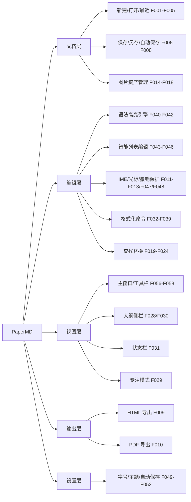

# PaperMD 产品能力树（FEATURE_MAP）

> 版本：v1.0　日期：2026-09-03
> 事实来源：`docs/02_product/PRD.md` §4（功能架构树）+ §5（F001-F060 功能列表）+ `docs/01_reverse/REVERSE_ANALYSIS.md` ⑤
> 说明：F 编号与 PRD/逆向报告完全对齐；分组沿用 PRD §4 五层（文档/编辑/视图/输出/设置）；状态=旧项目事实（含 A2 勘误后的口径）。

---

## 1. 能力树总览（五层 → F 编号）



（来源：`docs/02_product/PRD.md` §4，原样转绘）

## 2. 分组明细（F001-F060 全量）

### G1 文档层——文档生命周期（F001-F008）

| 功能ID | 名称 | 描述 | 优先级 | 状态 |
|--------|------|------|--------|------|
| F001 | 启动与窗口保活 | 启动复用/新建 Document 并置前主窗口；Dock 重开、关窗不退 App | P0 | 已实现 |
| F002 | 新建文档 | ⌘N 直建文档+窗口 | P0 | 已实现 |
| F003 | 打开文档 | ⌘O 系统面板打开 .md/.markdown | P1 | 已实现 |
| F004 | 最近文档菜单 | Open Recent 动态列表+Clear Menu | P1 | 已实现 |
| F005 | 关闭窗口 | ⌘W，最后窗口关闭不退出 | P2 | 已实现 |
| F006 | 保存 | ⌘S，无文件时弹面板，默认补 .md | P0 | 已实现 |
| F007 | 另存为 | ⇧⌘S | P1 | 已实现 |
| F008 | 自动保存 | 偏好开关，3 秒无操作落盘（仅已保存文档） | P1 | 已实现 |

### G2 文档层——图片资产管线（F014-F018）

| 功能ID | 名称 | 描述 | 优先级 | 状态 |
|--------|------|------|--------|------|
| F014 | 图片粘贴 | 落盘+插入  | P0 | 已实现 |
| F015 | 图片拖拽 | 落点字符位置插入 | P0 | 已实现 |
| F016 | 图片资产存储 | {文档名}.assets/，未保存先入临时目录 | P0 | 已实现 |
| F017 | 首存迁移图片 | 首次保存迁移临时资产并改写路径 | P0 | 已实现 |
| F018 | 图片撤销组 | 文本+文件成对撤销/重做 | P0 | 已实现 |

（另 F013 纯文本粘贴属编辑层，见 G4。）

### G3 编辑层——语法高亮引擎（F040-F042）

| 功能ID | 名称 | 描述 | 优先级 | 状态 |
|--------|------|------|--------|------|
| F040 | 语法高亮 | 标题/粗斜删/行内码/链接/图片/列表/任务/引用/代码块/HR/图片行背景/HTML 标签 | P0 | 已实现 |
| F041 | 行级增量高亮 | 仅重算受影响行+代码块扩展 | P0 | 已实现 |
| F042 | GFM 表格 | 解析+导出（编辑器高亮不含表格——已知差距） | P2 | 部分实现 |

### G4 编辑层——基础编辑与保护（F011-F013/F047/F048）

| 功能ID | 名称 | 描述 | 优先级 | 状态 |
|--------|------|------|--------|------|
| F011 | 撤销/重做 | ⌘Z/⇧⌘Z，NSUndoManager | P0 | 已实现 |
| F012 | 剪切/复制/全选 | 系统标准 | P0 | 已实现 |
| F013 | 纯文本粘贴 | ⌘V 去外部格式 | P0 | 已实现 |
| F047 | IME 保护 | marked text 期间不重建格式化/不拦截键 | P0 | 已实现 |
| F048 | 光标保持 | 格式化前后选区保存恢复 | P0 | 已实现 |

### G5 编辑层——智能列表（F043-F046）

| 功能ID | 名称 | 描述 | 优先级 | 状态 |
|--------|------|------|--------|------|
| F043 | 列表续行 | Enter 续（无序同符号/有序+1/任务续 [ ]） | P0 | 已实现 |
| F044 | 空项终止列表 | 空列表项 Enter 删 marker 换行【A2 勘误：旧 App 分支不可达，实际为普通换行 marker 残留；本条为文档意图规格，V1 按此呈现】 | P0 | 已实现（分支未触发） |
| F045 | 列表缩进 | Tab/⇧Tab 2 空格 | P0 | 已实现 |
| F046 | 删除空列表项 | Backspace 连换行合并【A2 勘误：同 F044 分支不可达；V1 按文档意图规格呈现】 | P0 | 已实现（分支未触发） |

### G6 编辑层——格式化命令（F032-F039/F058）

| 功能ID | 名称 | 描述 | 优先级 | 状态 |
|--------|------|------|--------|------|
| F032 | 粗体 | ⌘B 包裹 ** | P0 | 已实现 |
| F033 | 斜体 | ⌘I 包裹 * | P0 | 已实现 |
| F034 | 行内代码 | ⌘K 包裹 ` | P0 | 已实现 |
| F035 | 删除线 | ⌥⌘S 包裹 ~~（仅菜单） | P1 | 已实现 |
| F036 | 标题 1-3 | ⇧⌘1/2/3 行首替换（剥离旧 #） | P0 | 已实现 |
| F037 | 引用 | ⌥⌘> 行首 > | P1 | 已实现 |
| F038 | 代码块 | ⌥⌘C ``` 包裹 | P1 | 已实现 |
| F039 | 插入链接 | ⇧⌘L [text](url) 占位选中 | P1 | 已实现 |
| F058 | 命令启用校验 | 格式化需选区才可用 | P2 | 已实现 |
| F060 | H4-H6 入口 | 高亮支持但无菜单/快捷键 | P2 | 部分实现 |

### G7 编辑层——查找替换与文本工具（F019-F027）

| 功能ID | 名称 | 描述 | 优先级 | 状态 |
|--------|------|------|--------|------|
| F019 | 查找替换面板 | ⌘F 打开（v1.1） | P1 | 已实现 |
| F020 | 查找下一个 | 选区后起搜+到尾回绕 | P1 | 已实现 |
| F021 | 替换单处 | 替换后自动跳下一个 | P1 | 已实现 |
| F022 | 全部替换 | 整文替换（旧实现不入 undo——已知局限） | P1 | 已实现 |
| F023 | 正则查找替换 | 面板复选框切换 | P1 | 已实现 |
| F024 | 菜单查找导航项 | ⌘G/⇧⌘G/⌥⌘F（旧实现绑定系统动作未联动自研面板） | P2 | 部分实现 |
| F025 | 拼写菜单 | 系统拼写面板（连续拼写关闭） | P2 | 部分实现 |
| F026 | 大小写转换 | ⌃⌘U/⌃⌘L/⌥⌘C 系统 | P2 | 已实现 |
| F027 | 跳到选区 | ⌘J | P2 | 已实现 |

### G8 视图层（F028-F031/F056/F057）

| 功能ID | 名称 | 描述 | 优先级 | 状态 |
|--------|------|------|--------|------|
| F028 | 侧栏切换 | ⌃⌘O/工具栏 | P1 | 已实现 |
| F029 | 专注模式 | ⌃⌘F，隐藏侧栏+状态栏+工具栏 | P1 | 已实现 |
| F030 | 大纲导航 | 标题自动生成+点击/双击跳转 | P1 | 已实现 |
| F031 | 状态栏统计 | 词数/字符数/阅读时间（200wpm） | P1 | 已实现 |
| F056 | 窗口菜单 | 最小化/缩放/置前 | P2 | 已实现 |
| F057 | 工具栏 | 7 项固定布局 | P1 | 已实现 |

### G9 输出层（F009/F010）

| 功能ID | 名称 | 描述 | 优先级 | 状态 |
|--------|------|------|--------|------|
| F009 | 导出 HTML | ⌃⌘E，统一解析器+主题 CSS | P1 | 已实现 |
| F010 | 导出 PDF | ⌃⌘P，HTML→WKWebView→系统打印 | P1 | 已实现 |

### G10 设置层与杂项（F049-F055/F059）

| 功能ID | 名称 | 描述 | 优先级 | 状态 |
|--------|------|------|--------|------|
| F049 | 字号设置 | 12-24 共 10 档 | P2 | 已实现 |
| F050 | 主题 | Light/Dark/System 三态联动全 App | P2 | 已实现 |
| F051 | 自动保存开关 | 偏好复选框 | P1 | 已实现 |
| F052 | 偏好即时生效 | 全文重排版且光标不动 | P0 | 已实现 |
| F053 | 欢迎文本 | 新文档预填 # Hello PaperMD | P2 | 已实现 |
| F054 | About 面板 | 系统标准 | P2 | 已实现 |
| F055 | 帮助菜单 | ⇧⌘?（无 Help book——行为未知） | P2 | 部分实现 |
| F059 | 预览切换 | 旧版空壳（togglePreview 仅日志） | P2 | 未实现（保留占位，不新增） |

## 3. 状态统计与已知缺口

- 60 项功能：已实现 52 / 部分实现 6（F024、F025、F042、F044（分支未触发）、F046（分支未触发）、F055）/ 未实现 1（F059 空壳占位）+ 部分实现 F060。（口径来源：`docs/02_product/PRD.md` §5 各行状态列汇总）
- 已知缺口与 B 类修复映射见 `docs/06_review/PRODUCT_REVIEW.md` §五（B1-B8）；逻辑评审新立问题（UF/IA/PL 系列）见 `docs/product-review/USER_FLOW_REVIEW.md`、`docs/product-review/INFORMATION_ARCHITECTURE_REVIEW.md`。
