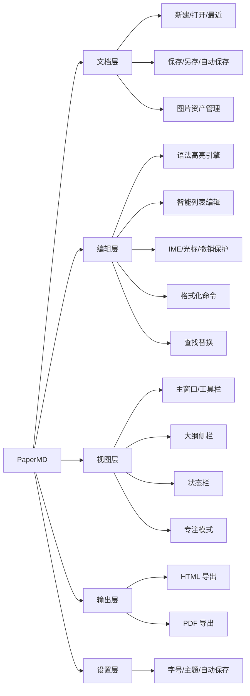
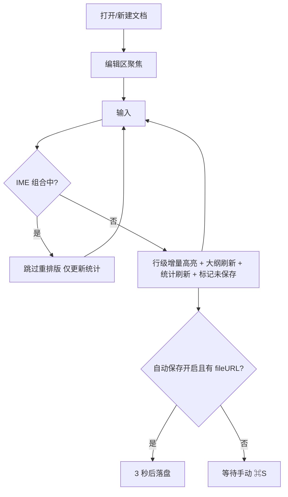
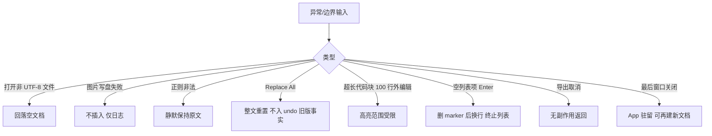

# PaperMD 产品需求文档（PRD）

> 版本：v1.0-rebuild（基于旧项目逆向事实重建，功能 ID 与《逆向分析报告》完全对齐）
> 日期：2026-09-02
> 事实来源：旧项目源码（PaperMD/App、PaperMD/Core）、README.md、CHANGELOG.md、CLAUDE.md、docs/产品说明.md、docs/UI.md、docs/ROADMAP.md、Tests/、PaperMDTests/
> 说明：本文档为"照旧复刻"型 PRD——范围以旧项目已实现事实为准，不新增商业功能，不删减复杂功能。旧文档与代码矛盾处按代码为准并标注。

---

## 1. 产品介绍

PaperMD 是一款原生 macOS Markdown **语法高亮编辑器**，保留源码可见（`#`、`**` 等标记不隐藏），以"极致输入体验"为最高优先级，面向长文写作、文档编写与技术写作。本地优先：文件即文档，无私有格式，无云端依赖。

产品四铁律（P0，来自 README「开发理念」与 CLAUDE.md）：

1. 光标位置必须符合用户预期，永不因渲染跳动。
2. 自动格式化绝不移动光标。
3. 中文输入法（IME）组合期间不进行布局重建或结构转换。
4. 每个结构变更（含图片插入）必须可撤销。

一句话价值主张：写起来最像在思考的 Markdown 编辑器（docs/产品说明.md 1.2）。

## 2. 用户画像

| 画像 | 特征 | 核心诉求 | 对应功能 |
|------|------|----------|----------|
| 开发者 | 写 README/技术文档/设计说明，英文中文混输，重度快捷键用户 | 快、可预测、纯文本保真 | F011-F013、F032-F039、F040 |
| 内容创作者 | 教程/博客/公众号长文，粘贴图片频繁 | 图片自动落盘、不破坏 .md、统计字数 | F014-F018、F031 |
| 长文写作者 | 方案/手册/连续写作 1 小时+ | 大纲导航、专注模式、自动保存 | F028-F031、F008 |
| 中文写作用户 | 输入法组合频繁 | IME 稳定、不丢字不跳标 | F047 |

非目标用户（v1 明确不满足）：实时协作、强笔记/知识图谱、AI 写作依赖、需要云同步的用户。

## 3. 使用场景

- **场景 1 快速开写**：双击打开 App → 1 秒内进入编辑态，光标已在文档中（欢迎文本预填）。
- **场景 2 连续写作 1 小时**：无输入延迟、无 UI 抖动、无误触焦点丢失；3 秒自动保存兜底。
- **场景 3 插入结构内容**：`#` 出标题、```` ``` ```` 出代码块；Enter 自动续列表；Tab 缩进。
- **场景 4 插入图片**：截图后直接 ⌘V，图片自动写入 `{文档名}.assets/`，正文出现 `` 源文本。
- **场景 5 导出交付**：⌃⌘E 导出带主题 CSS 的 HTML；⌃⌘P 经打印面板存 PDF。
- **场景 6 长文导航**：侧栏大纲点击跳转标题行；⌘F 查找替换（含正则）。
- **场景 7 深度专注**：⌃⌘F 进入专注模式，侧栏/状态栏/工具栏全部隐去。

## 4. 功能架构



## 5. 功能列表表

ID 与逆向报告 ⑤ 节完全对齐；优先级参照 docs/产品说明.md 第 3 节（P0 输入体验 > P1 文件/导出/大纲 > P2 UI 美观）映射；状态=旧项目事实。

| 功能ID | 名称 | 描述 | 优先级 | 状态 |
|--------|------|------|--------|------|
| F001 | 启动与窗口保活 | 启动复用/新建 Document 并置前主窗口；Dock 重开、关窗不退 App | P0 | 已实现 |
| F002 | 新建文档 | ⌘N 直建文档+窗口 | P0 | 已实现 |
| F003 | 打开文档 | ⌘O 系统面板打开 .md/.markdown | P1 | 已实现 |
| F004 | 最近文档菜单 | Open Recent 动态列表+Clear Menu | P1 | 已实现 |
| F005 | 关闭窗口 | ⌘W，最后窗口关闭不退出 | P2 | 已实现 |
| F006 | 保存 | ⌘S，无文件时弹面板，默认补 .md | P0 | 已实现 |
| F007 | 另存为 | ⇧⌘S | P1 | 已实现 |
| F008 | 自动保存 | 偏好开关，3 秒无操作落盘（仅已保存文档） | P1 | 已实现 |
| F009 | 导出 HTML | ⌃⌘E，统一解析器+主题 CSS | P1 | 已实现 |
| F010 | 导出 PDF | ⌃⌘P，HTML→WKWebView→系统打印 | P1 | 已实现 |
| F011 | 撤销/重做 | ⌘Z/⇧⌘Z，NSUndoManager | P0 | 已实现 |
| F012 | 剪切/复制/全选 | 系统标准 | P0 | 已实现 |
| F013 | 纯文本粘贴 | ⌘V 去外部格式 | P0 | 已实现 |
| F014 | 图片粘贴 | 落盘+插入  | P0 | 已实现 |
| F015 | 图片拖拽 | 落点字符位置插入 | P0 | 已实现 |
| F016 | 图片资产存储 | {文档名}.assets/，未保存先入临时目录 | P0 | 已实现 |
| F017 | 首存迁移图片 | 首次保存迁移临时资产并改写路径 | P0 | 已实现 |
| F018 | 图片撤销组 | 文本+文件成对撤销/重做 | P0 | 已实现 |
| F019 | 查找替换面板 | ⌘F 打开（v1.1） | P1 | 已实现 |
| F020 | 查找下一个 | 选区后起搜+到尾回绕 | P1 | 已实现 |
| F021 | 替换单处 | 替换后自动跳下一个 | P1 | 已实现 |
| F022 | 全部替换 | 整文替换（旧实现不入 undo——已知局限） | P1 | 已实现 |
| F023 | 正则查找替换 | 面板复选框切换 | P1 | 已实现 |
| F024 | 菜单查找导航项 | ⌘G/⇧⌘G/⌥⌘F（旧实现绑定系统动作未联动自研面板） | P2 | 部分实现 |
| F025 | 拼写菜单 | 系统拼写面板（连续拼写关闭） | P2 | 部分实现 |
| F026 | 大小写转换 | ⌃⌘U/⌃⌘L/⌥⌘C 系统 | P2 | 已实现 |
| F027 | 跳到选区 | ⌘J | P2 | 已实现 |
| F028 | 侧栏切换 | ⌃⌘O/工具栏 | P1 | 已实现 |
| F029 | 专注模式 | ⌃⌘F，隐藏侧栏+状态栏+工具栏 | P1 | 已实现 |
| F030 | 大纲导航 | 标题自动生成+点击/双击跳转 | P1 | 已实现 |
| F031 | 状态栏统计 | 词数/字符数/阅读时间（200wpm） | P1 | 已实现 |
| F032 | 粗体 | ⌘B 包裹 ** | P0 | 已实现 |
| F033 | 斜体 | ⌘I 包裹 * | P0 | 已实现 |
| F034 | 行内代码 | ⌘K 包裹 ` | P0 | 已实现 |
| F035 | 删除线 | ⌥⌘S 包裹 ~~（仅菜单） | P1 | 已实现 |
| F036 | 标题 1-3 | ⇧⌘1/2/3 行首替换（剥离旧 #） | P0 | 已实现 |
| F037 | 引用 | ⌥⌘> 行首 > | P1 | 已实现 |
| F038 | 代码块 | ⌥⌘C ``` 包裹 | P1 | 已实现 |
| F039 | 插入链接 | ⇧⌘L [text](url) 占位选中 | P1 | 已实现 |
| F040 | 语法高亮 | 标题/粗斜删/行内码/链接/图片/列表/任务/引用/代码块/HR/图片行背景/HTML 标签 | P0 | 已实现 |
| F041 | 行级增量高亮 | 仅重算受影响行+代码块扩展 | P0 | 已实现 |
| F042 | GFM 表格 | 解析+导出（编辑器高亮不含表格——已知差距） | P2 | 部分实现 |
| F043 | 列表续行 | Enter 续（无序同符号/有序+1/任务续 [ ]） | P0 | 已实现 |
| F044 | 空项终止列表 | 空列表项 Enter 删 marker 换行【A2 勘误：旧 App 分支不可达，实际为普通换行 marker 残留；本条为文档意图规格，V1 按此呈现】 | P0 | 已实现（分支未触发） |
| F045 | 列表缩进 | Tab/⇧Tab 2 空格 | P0 | 已实现 |
| F046 | 删除空列表项 | Backspace 连换行合并【A2 勘误：同 F044 分支不可达；V1 按文档意图规格呈现】 | P0 | 已实现（分支未触发） |
| F047 | IME 保护 | marked text 期间不重建格式化/不拦截键 | P0 | 已实现 |
| F048 | 光标保持 | 格式化前后选区保存恢复 | P0 | 已实现 |
| F049 | 字号设置 | 12-24 共 10 档 | P2 | 已实现 |
| F050 | 主题 | Light/Dark/System 三态联动全 App | P2 | 已实现 |
| F051 | 自动保存开关 | 偏好复选框 | P1 | 已实现 |
| F052 | 偏好即时生效 | 全文重排版且光标不动 | P0 | 已实现 |
| F053 | 欢迎文本 | 新文档预填 # Hello PaperMD | P2 | 已实现 |
| F054 | About 面板 | 系统标准 | P2 | 已实现 |
| F055 | 帮助菜单 | ⇧⌘?（无 Help book——行为未知） | P2 | 部分实现 |
| F056 | 窗口菜单 | 最小化/缩放/置前 | P2 | 已实现 |
| F057 | 工具栏 | 7 项固定布局 | P1 | 已实现 |
| F058 | 命令启用校验 | 格式化需选区才可用 | P2 | 已实现 |
| F059 | 预览切换 | 旧版空壳（togglePreview 仅日志） | P2 | 未实现（保留占位，不新增） |
| F060 | H4-H6 入口 | 高亮支持但无菜单/快捷键 | P2 | 部分实现 |

## 6. 页面需求

> 页面编号 PAGE001-014 见逆向报告 ③；此处定义每页的产品需求。详细交互见《page-spec.md》。

### PAGE001 主编辑窗口（对应 F001/F002/F003/F005/F006/F007）
- **目标**：单文档编辑的完整容器，文件即文档。
- **入口**：启动自动创建；⌘N；⌘O；Dock 重开。
- **展示内容**：标题栏（未保存时显示"已编辑"标记）、工具栏、大纲侧栏+编辑区分栏、状态栏；初始 800×600 主屏居中。
- **操作/响应**：窗口激活→编辑区自动聚焦；关闭→已编辑则系统提示保存；关最后窗口→App 保持驻留。
- **状态**：干净态 / 未保存编辑态 / 专注态（PAGE007）。
- **异常**：文档打开失败→空文档兜底；窗口创建失败仅日志。

### PAGE002 应用菜单栏（对应 F004/F009/F010/F019/F024-F027/F055/F056 等）
- **目标**：全量命令入口，全键盘可达。
- **入口**：系统菜单栏常驻。
- **展示内容**：7 菜单（PaperMD/File/Edit/View/Format/Window/Help），含全部快捷键标注（⌘/⌥/⌃/⇧ 组合，见全局约定）。
- **操作/响应**：每项经响应链执行对应 F 功能；不可用项灰显（如无选区时 Bold）。
- **状态**：Undo/Redo 按 canUndo/canRedo 启停；格式化项按选区启停。
- **异常**：最近文档已删除→打开失败仅日志。

### PAGE003 大纲侧栏（对应 F030）
- **目标**：结构化导航。
- **入口**：主窗口左栏（200pt）；⌃⌘O / 工具栏 Sidebar 切换显隐。
- **展示内容**：标题树（按级别缩进+字体分级 H1 bold14/H2 bold13/其余 13）；空文档=空列表。
- **操作/响应**：单击/双击行→编辑区选中该标题行、滚动可见、光标收缩到行首（0.1s 延迟闪烁提示）。
- **状态**：随文本实时刷新（异步）。
- **异常**：无标题→空态；越界行忽略。

### PAGE004 Markdown 编辑区（对应 F013-F018/F032-F048）
- **目标**：P0 输入体验承载。
- **入口**：主窗口中部，窗口激活即聚焦。
- **展示内容**：带语法高亮的 Markdown 源码（标记可见）；基础字号随偏好。
- **操作/响应**：打字/删除（undo 可逆）；Enter 列表续行；Tab/⇧Tab 缩进；Backspace 空项合并；⌘V 纯文本/图片分流；格式化命令包裹/行首替换；拖入图片落点插入。
- **状态**：普通态/IME 组合态（仅统计刷新）/格式化重排中（防重入）。
- **异常**：图片写盘失败→不插入仅日志；编码失败→空文档。

### PAGE005 状态栏（对应 F031）
- **目标**：写作量化反馈。
- **入口**：主窗口 28pt 条（专注模式隐藏）。
- **展示内容**：`N words | N characters | N min read`。
- **操作/响应**：无交互；每次文本变化刷新。
- **状态/异常**：空文档 0/0/1（阅读时间下限 1，照实保留）。

### PAGE006 工具栏（对应 F028/F032-F034/F036-F038/F057）
- **目标**：高频格式化一键化。
- **入口**：标题栏下方；图标模式、不可自定义。
- **展示内容**：Sidebar｜⎷分隔｜弹性空隙｜Bold｜Italic｜Code｜Heading(H1)｜Quote｜CodeBlock，各带 tooltip（含快捷键）。
- **操作/响应**：点击执行与菜单同源动作；Bold/Italic/Code 需选区（否则禁用）。
- **状态**：专注模式整体隐藏。

### PAGE007 专注模式（对应 F029）
- **目标**：免打扰写作。
- **入口**：⌃⌘F。
- **展示内容**：仅编辑区（0.25s 动画折叠侧栏；状态栏与工具栏隐藏）。
- **操作/响应**：再次 ⌃⌘F 还原全部。
- **状态**：二态切换。

### PAGE008 偏好设置窗口（对应 F008/F049/F050/F051/F052）
- **目标**：全局偏好管理。
- **入口**：⌘,；450×300 单例窗口。
- **展示内容**：Editor Font Size（12-24 十档弹出）/ Appearance（Light/Dark/System）/ General（自动保存复选框）。
- **操作/响应**：任一修改即时生效（写 UserDefaults→主题套用→广播→全文重排版，光标保持）。
- **状态**：当前值选中态。
- **异常**：无（UserDefaults 托管）。

### PAGE009 查找替换面板（对应 F019-F023）
- **目标**：文档内检索与批量修改。
- **入口**：⌘F；420×160。
- **展示内容**：Find/Replace 输入框、正则复选框、Find Next/Replace/Replace All 三按钮。
- **操作/响应**：Find Next 选中并滚动到命中（到尾回绕）；Replace 单处替换后自动跳下一个；Replace All 整文替换；正则非法静默保持原文。
- **状态**：普通/正则两模式。
- **异常**：空查询忽略；无命中无提示（保持原状）。

### PAGE010 打开文件面板（对应 F003/F004）
- **目标**：打开本地文档。
- **入口**：⌘O / 最近文档项。
- **展示内容**：系统 NSOpenPanel（沙盒内用户授权目录）。
- **操作/响应**：确认→读取→高亮/大纲/统计→自动保存计时启动。
- **异常**：UTF-8 解码失败→空文档；最近项失效→日志。

### PAGE011 保存/另存为面板（对应 F006/F007）
- **目标**：落盘纯 Markdown。
- **入口**：⌘S（无文件时）/ ⇧⌘S。
- **展示内容**：系统 NSSavePanel，默认名 untitled.md / {文档名}.md。
- **操作/响应**：确认→迁移 pending 图片→UTF-8 落盘。
- **异常**：写失败走系统错误反馈。

### PAGE012 导出 HTML 面板（对应 F009）
- **目标**：交付 HTML。
- **入口**：⌃⌘E。
- **展示内容**：系统保存面板，默认 {文档名}.html。
- **操作/响应**：确认→统一解析器生成+主题 CSS→原子写入；取消→无副作用。
- **异常**：写失败仅日志（旧版事实，复刻保留）。

### PAGE013 导出 PDF 打印面板（对应 F010）
- **目标**：交付 PDF。
- **入口**：⌃⌘P。
- **展示内容**：系统打印面板（内容=WKWebView 渲染的导出 HTML，612×792，横向 fit 纵向自动分页）。
- **操作/响应**：确认→系统完成"存储为 PDF"；取消→无副作用。
- **异常**：无目录功能（旧文档宣称"PDF 支持目录"与实现矛盾，以代码为准）。

### PAGE014 关于面板（对应 F054）
- **目标**：应用信息。系统标准 About（版本 1.0）。

## 7. 业务流程

### 7.1 核心写作循环（P0）



### 7.2 保存与图片资产一致性

```mermaid
flowchart TD
    A[⌘S] --> B{有 fileURL?}
    B -- 否 --> C[保存面板 untitled.md]
    B -- 是 --> D[writeSafely]
    C --> D
    D --> E{存在 pending 临时图片?}
    E -- 是 --> F[迁移至 {文档名}.assets/ 并改写 ]
    E -- 否 --> G[直接落盘]
    F --> G
    G --> H[textView.string UTF-8 写入]
    H --> I[清除未保存标记]
```

### 7.3 异常与边界流程



## 8. 验收标准（Given-When-Then）

> 每功能至少一条；执行基准为旧项目 Tests/INPUT_REGRESSION_CHECKLIST.md 与 PaperMDTests。

- **F001 启动**：Given 用户双击启动 App，When 启动完成，Then 800×600 主窗口主屏居中显示，编辑区已聚焦，可见欢迎文本。
- **F002 新建**：Given 主窗口存在，When 按 ⌘N，Then 新建 Document 并打开新编辑窗口（标题 Untitled）。
- **F003 打开**：Given 磁盘有合法 .md，When ⌘O 选择并确认，Then 窗口载入全文且高亮/大纲/统计就绪。
- **F003-异常**：Given 文件非 UTF-8，When 打开，Then 不崩溃，展示空文档。
- **F004 最近**：Given 打开过 ≥1 个文档，When 展开 Open Recent，Then 列表含文件名（tooltip 全路径）且有 Clear Menu。
- **F006 保存**：Given 编辑未保存文档，When ⌘S 并在面板确认，Then 磁盘内容=编辑器 string（源保真，`` 为纯文本）。
- **F008 自动保存**：Given 偏好开启自动保存且文档已保存过，When 停止输入 3 秒，Then 文件已更新为最新文本。
- **F008-关闭**：Given 偏好关闭自动保存，When 编辑后等待任意时长，Then 不自动落盘。
- **F009 导出 HTML**：Given 文档含标题/列表/代码块/表格，When ⌃⌘E 确认导出，Then HTML 含 `<h1>`、`<ul>`、`<pre><code>`、`<table>` 且带主题 CSS。
- **F009-取消**：Given 导出面板打开，When 点击取消，Then 无文件产生、文档状态不变。
- **F010 导出 PDF**：Given 任意文档，When ⌃⌘P，Then 系统打印面板出现且预览为渲染后的 HTML 内容。
- **F011 撤销**：Given 有可撤销操作，When ⌘Z，Then 上一步回退且光标位置合理；⇧⌘Z 恢复。
- **F011-图片撤销**：Given 刚粘贴图片，When ⌘Z，Then `` 文本消失且 assets 中文件同被删除；重做则双双恢复。
- **F013 纯文本粘贴**：Given 剪贴板为带格式富文本，When ⌘V，Then 插入内容无任何富文本属性。
- **F014 图片粘贴**：Given 剪贴板含截图，When ⌘V，Then 正文插入 `` 且文件落盘。
- **F017 首存迁移**：Given 未保存文档已插入图片（临时目录），When 首次保存，Then 图片移入 `{文档名}.assets/` 且路径改写。
- **F019 查找面板**：Given 编辑窗口聚焦，When ⌘F，Then 面板出现且焦点在 Find 框。
- **F020 查找**：Given 文档含多个 "foo"，When Find Next 两次，Then 依次选中第 1、2 个并滚动可见；第三次从头部回绕。
- **F022 全部替换**：Given 文档含 3 处 "a"，When Replace All 为 "b"，Then 0 处 "a" 剩余。
- **F023 正则**：Given 勾选正则，When Find 输入 `\d+`，Then 数字串被命中；非法正则时保持原文不崩溃。
- **F028 侧栏**：When ⌃⌘O，Then 侧栏 200pt↔0 切换。
- **F029 专注**：When ⌃⌘F，Then 0.25s 内侧栏折叠+状态栏隐藏+工具栏隐藏；再次触发还原。
- **F030 大纲**：Given 文档含多级标题，When 点击大纲某 H2，Then 编辑区选中该标题行并滚动可见，随后光标收缩行首。
- **F031 统计**：Given 文本 N 词，Then 状态栏显示 N words / 字符数 / max(1,⌊N/200⌋) min read。
- **F032 粗体**：Given 选中 "word"，When ⌘B，Then 文本变为 `**word**` 且整段保持选中。
- **F032-无选区**：Given 无选区，Then Bold 菜单/工具栏禁用。
- **F036 标题**：Given 光标在 "## old" 行，When ⇧⌘1，Then 行变为 "# old"，光标在 `# ` 之后。
- **F038 代码块**：Given 选中 "code"，When ⌥⌘C，Then 插入围栏块 `\n```\ncode\n```\n`。
- **F040 高亮**：Given 打开 Tests/SyntaxHighlightingTest.md，Then 标题大字号蓝色、代码块等宽灰、行内码粉色、链接蓝色下划线、任务项 [x] 绿色、独立图片行有淡紫背景。
- **F043 续行**：Given 光标在 "- item" 行尾，When Enter，Then 新行以 "- " 开头光标在标记后；有序 "1. " 续为 "2. "；任务续 "- [ ] "。
- **F044 终止**：Given 光标在空项 "- " 行尾，When Enter，Then marker 被删除仅留空行。
- **F045 缩进**：Given 光标在列表行，When Tab/⇧Tab，Then 行首 +2/-2 空格。
- **F046 删空项**：Given 空项 "- " 且光标紧跟其后，When Backspace，Then 该行与上一行合并。
- **F047 IME**：Given 中文输入法组合中（marked text），When 持续输入，Then 无高亮重建、无丢字、无跳标（对照 EditorInteractionTests/清单 P0）。
- **F048 光标**：Given 光标在段落中间，When 触发格式化重排，Then 光标位置不变（testReapplyFormattingPreservesCursor）。
- **F050 主题**：When 偏好切 Dark，Then NSAppearance、编辑器配色、导出 CSS 三处同步变暗。
- **F052 即时生效**：When 修改字号，Then 全文字号更新且光标原位。
- **F053 欢迎文本**：Given 新建空文档，Then 编辑器预填 `# Hello PaperMD\n\nStart typing your Markdown here...`。
- **F058 启停校验**：Given 无选区，Then Bold/Italic/Code/Strikethrough/Link 禁用，Heading/Blockquote/CodeBlock/侧栏/专注可用。
