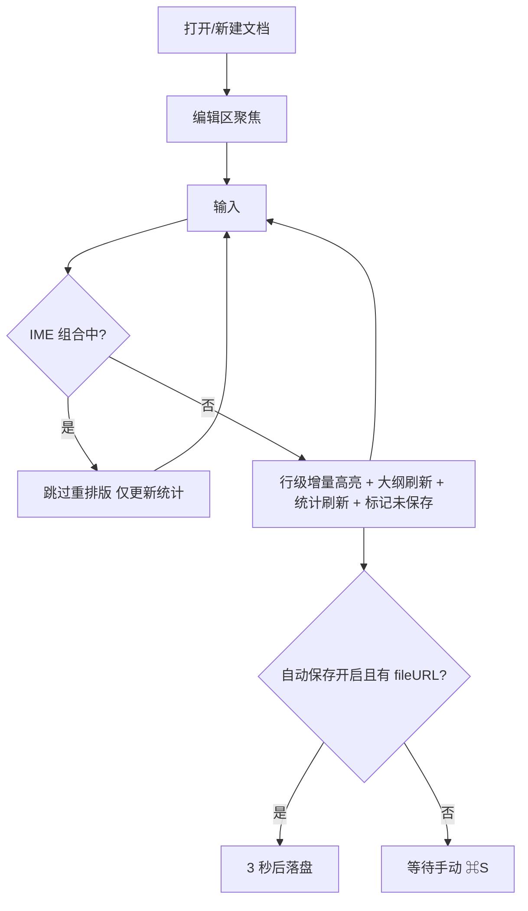
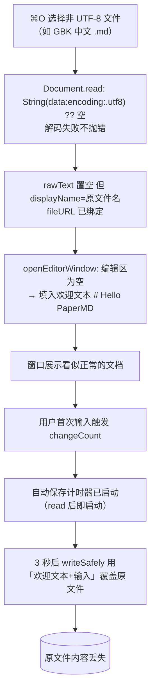
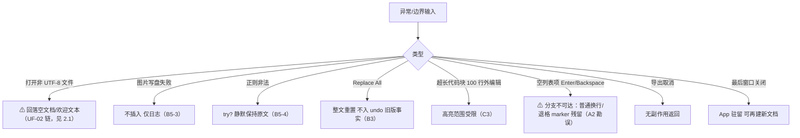

# PaperMD 业务流程——正常 / 异常 / 边界（BUSINESS_FLOW）

> 版本：v1.0　日期：2026-09-03
> 事实来源：`docs/02_product/PRD.md` §7（业务流程三图）；`docs/01_reverse/REVERSE_ANALYSIS.md` ⑥⑨；`docs/product-review/USER_FLOW_REVIEW.md`（UF 问题链）；`docs/product-review/DATA_STORAGE_REVIEW.md`
> 说明：本文件按「正常 / 异常 / 边界」三档重组既有事实；**已知缺陷以 ⚠ 显式标注**（UF/PL/P4 编号），不美化旧行为。

---

## 1. 正常流程（主业务循环）

### 1.1 核心写作循环（P0）



（源：PRD §7.1 原图）

### 1.2 保存与图片资产一致性

```mermaid
flowchart TD
    A[⌘S] --> B{有 fileURL?}
    B -- 否 --> C[保存面板 untitled.md]
    B -- 是 --> D[writeSafely]
    C --> D
    D --> E{存在 pending 临时图片?}
    E -- 是 --> F[迁移至 {文档名}.assets/ 并改写 ]
    E -- 否 --> G[直接落盘]
    F --> G
    G --> H[textView.string UTF-8 写入]
    H --> I[清除未保存标记]
```

（源：PRD §7.2 原图；⚠ 迁移环节的事务性缺陷见 §2.3）

## 2. 异常流程（含已知缺陷链）

### 2.1 ⚠ 已知缺陷链：非 UTF-8 解码失败 → 欢迎文本文档 → 3 秒自动保存覆盖写回原文件【UF-02 / PL-01，B 级】



（源：`docs/product-review/USER_FLOW_REVIEW.md` §三 UF-02 对 `Document.swift` L80-84、L167、L174-176 的源码还原；PRD §7.3 原图仅记「回落空文档」，本链为逻辑评审升级结论——实际行为更重：窗口展示的是欢迎模板而非空文档，用户更难意识到内容非原文件）

**处置状态**：P4 原记 L-03/B5（V1 给可见反馈）；UF-02 升级为独立 B 级——重写期须「解码失败改为可见错误且不绑定 fileURL 进入可保存状态（或只读+提示打开），编码失败时禁止自动保存计时」。V1 原型已按修复后规格呈现。

### 2.2 其他异常路径（照实登记）



（源：PRD §7.3 原图 + REVERSE_ANALYSIS.md ⑨ 部分实现清单；A2 勘误见 `docs/06_review/PRODUCT_REVIEW.md` F-12）

**逐条补充证据**（源：REVERSE_ANALYSIS.md ⑨ / P4 B5 清单）：

| 异常 | 用户可见反馈 | 源码事实 | 分级 |
|------|--------------|----------|------|
| 导出 HTML 写失败 | 无（仅 DebugLog） | `AppDelegate.swift` L397 | B5-1 |
| 自动保存失败 | 无（仅 debugLog） | `Document.swift` L201 | B5-2 |
| 图片写盘失败 | 无（不插入仅日志） | `ImageHandler.swift` L126-128 | B5-3 |
| 正则非法 | 无（静默返回原文） | `TextSearch.swift` L17、L35 | B5-4 |
| 查找无命中 | 无提示 | SearchReplaceController.findNext 尾部 | B5-5 |
| 最近文档打开失败 | 无（仅 DebugLog；根因=无书签） | `AppDelegate.swift` L333-340 | B5-6 / PM-01 |
| 打开非 UTF-8 | 无（⚠ 触发 2.1 缺陷链） | `Document.swift` L167 | B5-7 / UF-02 |

### 2.3 ⚠ 已知缺陷：首存图片迁移非事务式【UF-05 / PL-08，B 级】

- 事实：`migratePendingAssetsIfNeeded` 中逐文件 `try? fileManager.moveItem`（`ImageHandler.swift` L46）失败被吞，但 pathMap 仍登记该文件名；随后正文 `` 全部改写为新相对路径（L52-59），最后 `try? removeItem(at: pendingAssetsURL)` 无条件清空临时目录（L61）。
- 后果：move 失败（目标卷权限/同名占用/沙盒拒写）时正文指向新路径而文件不在（坏链），原临时文件随目录删除一并清除——**文本与文件双失**，⌘Z 无法恢复文件。
- 处置：V1 重写期改事务式——全部 move 成功才改写正文与清理目录，任一失败中止保存并给可见错误。（源：USER_FLOW_REVIEW.md §四 UF-05）

### 2.4 ⚠ 已知缺陷：外部修改无检测，自动保存静默覆盖【UF-03 / PL-05，B 级】

- 事实：全源码无文件修改日期/NSFileVersion/呈现冲突检查（grep `NSFileVersion|fileModificationDate|revertToSaved` 零命中）；自定义 3 秒 Timer 直接调 autosave 覆盖写。
- 后果：开发者用户在 Git/其他编辑器侧改同一文件，PaperMD 侧 3 秒 autosave 无提示用内存版本覆盖磁盘外部修改。
- 处置：重写期保存前比较磁盘修改时间/内容摘要，不一致给「保留我的版本/载入磁盘版本」选择。（源：USER_FLOW_REVIEW.md §三 UF-03；时序图见 `docs/05_sequence/SEQUENCE_DIAGRAMS.md` 图 5）

## 3. 边界流程（状态组合与生命周期）

| 边界 | 现行为 | 归档 |
|------|--------|------|
| untitled 文档无自动保存/崩溃恢复 | 自动保存计时器 guard `fileURL != nil`，untitled 被排除；无 AutosaveInformation 机制——崩溃=全丢 | UF-01（B → PL-09） |
| Sudden/Automatic Termination 声明 | Info.plist 两键均 true；最近 <3 秒编辑存在无提示丢失窗口；与「关窗驻留」存在语义张力 | UF-08（C → PL-04） |
| 专注模式中按 ⌃⌘O | 侧栏在专注态下展开形成混合态（toggleSidebar 独立于 focusMode） | P4 D5（观察不动） |
| 关闭未保存窗口 | NSDocument 标准三选弹窗（保存/取消/不保存） | P4 D4（照旧） |
| 「不保存」关闭后临时图片目录 | tmp 残留（不清理） | DS-02（PL-14，归数据分册） |
| 空文档统计 | 0 词显示 "1 min read"（max(1,·)） | P4 B7（V1 修复：0 词显示 0） |
| 欢迎文本随首存入文件 | 快速 ⌘S 后欢迎文本写入 .md | P4 D6（产品决策照旧） |
| 大文档加载 | 无 loading 指示；10k+ 行首次全量高亮耗时【未知——未基准化】 | page-spec 特检矩阵已标注；C5 Spike 量化项 |

（源：`docs/product-review/USER_FLOW_REVIEW.md` §二/§七/§八、`docs/06_review/PRODUCT_REVIEW.md` §三、`docs/04_architecture/STATE_MACHINE.md` §6）
