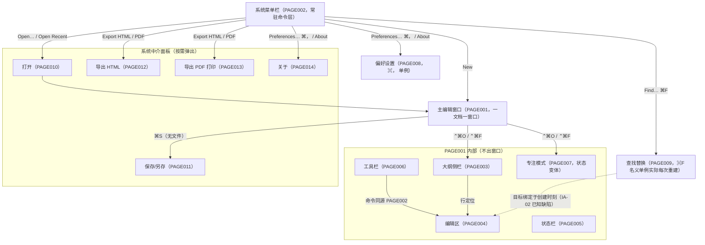

# PaperMD 页面流转（PAGE_FLOW）

> 版本：v1.0　日期：2026-09-03
> 事实来源：`docs/product-review/INFORMATION_ARCHITECTURE_REVIEW.md` §一（导航层级图，按源码绘制）、§二（逐窗口/面板分类归属表）；`docs/02_product/PRD.md` §6（页面需求 PAGE001-014）；`docs/01_reverse/REVERSE_ANALYSIS.md` ③④（页面清单与详细分析）
> 说明：macOS 文档类 App 的「页面」= 窗口/面板/状态变体；PAGE001-014 编号与 PRD/逆向报告对齐。

---

## 1. 窗口/面板跳转总图

（层级结构源：INFORMATION_ARCHITECTURE_REVIEW.md §一导航层级图；边按该图与 PRD §6 入口描述整理）

**层级深度评价**（源：同上）：**两层**（菜单/面板 → 主窗口），符合文档编辑器类目惯例；无超过两层的钻取；大纲、专注模式均控制在主窗口内部。结论：骨架合理，无结构性增删需求。

## 2. 出入口表（每页一行的进出关系）

| 编号 | 页面 | 入口（谁跳入） | 出口（跳去哪） | 备注 |
|------|------|----------------|----------------|------|
| PAGE001 | 主编辑窗口 | 启动自动创建；⌘N；⌘O 确认；Open Recent；Dock 重开 | ⌘W 关闭（最后窗口关闭 App 驻留）；无跳转出（面板均为平级弹出） | 一文档一窗口（`Document.swift` L54-94） |
| PAGE002 | 应用菜单栏 | 系统菜单栏常驻 | → PAGE001/008/009/010/012/013/014 | 全量命令入口，约 40 项（`AppDelegate.swift` L89-305） |
| PAGE003 | 大纲侧栏 | PAGE001 左栏（⌃⌘O/工具栏切换显隐） | 不出窗口：行 → 编辑区行定位 | 单击与双击同效（D7 冗余照旧） |
| PAGE004 | 编辑区 | PAGE001 中部，窗口激活即聚焦 | 无跳转出 | P0 输入体验载体 |
| PAGE005 | 状态栏 | PAGE001 28pt 条（专注模式隐藏） | 无交互，纯展示 | 顶部布局（D3 照旧） |
| PAGE006 | 工具栏 | PAGE001 标题栏下方 | 命令同源 PAGE002，无独立跳转 | 与菜单双入口属惯例 |
| PAGE007 | 专注模式 | ⌃⌘F（PAGE001 状态变体） | 再次 ⌃⌘F 还原 | 非独立页面；⌃⌘O 混合态见 D5 |
| PAGE008 | 偏好设置 | ⌘,（PAGE002） | 修改即时生效，无确认流 | 450×300 单例窗口 |
| PAGE009 | 查找替换 | ⌘F（PAGE002；⌘G/⇧⌘G 未联动——B2） | 面板外续搜断链（L-01） | 独立自由窗口，非 sheet 非模态（IA-02） |
| PAGE010 | 打开面板 | ⌘O / Open Recent（PAGE002） | 确认 → 载入 PAGE001 | NSOpenPanel；沙盒授权点（PM-01/PM-02） |
| PAGE011 | 保存/另存 | ⌘S（无文件）/ ⇧⌘S（PAGE001） | 确认 → 迁移图片 → 落盘 | 默认名 untitled.md（`Document.swift` L213-238） |
| PAGE012 | 导出 HTML | ⌃⌘E（PAGE002） | 确认 → 原子写 .html；取消无副作用 | 写失败仅日志（B5-1） |
| PAGE013 | 导出 PDF | ⌃⌘P（PAGE002） | 系统打印面板「存储为 PDF」 | WKWebView 渲染 612×792 |
| PAGE014 | 关于 | PAGE002 → About | 系统标准 | 版本 1.0 |

（源：PRD §6 各页「入口/操作响应」+ INFORMATION_ARCHITECTURE_REVIEW.md §二归属表的证据列）

## 3. 路由规则现状（含已知问题）

1. **文档级命令的隐含前置**：exportToHTML / exportToPDF / showSearchReplace 均以「keyWindow 且 contentView is EditorView」为守卫，失败静默 return——偏好/查找面板聚焦时 ⌃⌘E/⌃⌘P/⌘F 无任何反馈（IA-01，B 级 → PL-07）。（源：INFORMATION_ARCHITECTURE_REVIEW.md §五 IA-01，`AppDelegate.swift` L359-361、L377-381、L403-405）
2. **查找面板从属关系未定义**：PAGE009 实现为独立自由窗口，目标 textView 仅构造时绑定；多窗口切换后面板仍作用于旧窗口（IA-02/UF-06，B 级 → PL-06）。（源：同上 §五 IA-02）
3. **命令按域分组**：File/Edit/View/Format 划分与 macOS HIG 一致；唯一键冲突 ⌥⌘C 同键分属 Edit>Transformations 与 Format>Code Block（C4 留档）。（源：同上 §三.1）
