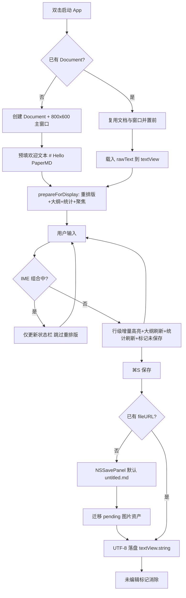
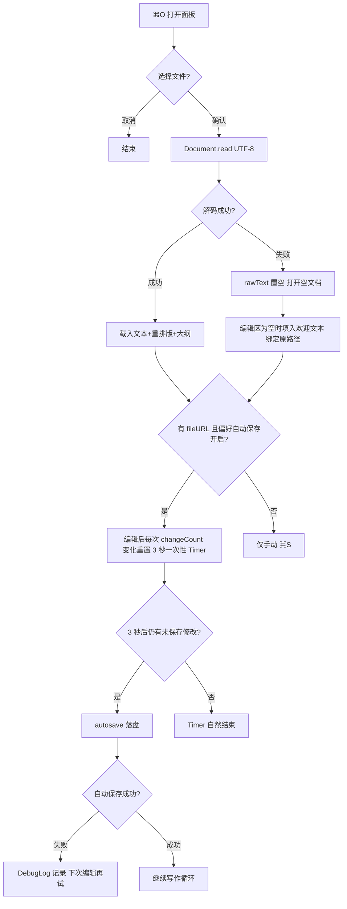
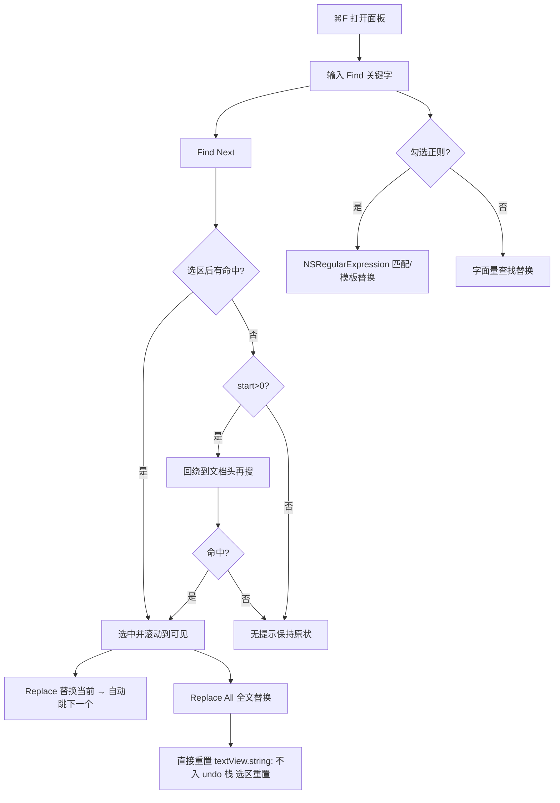
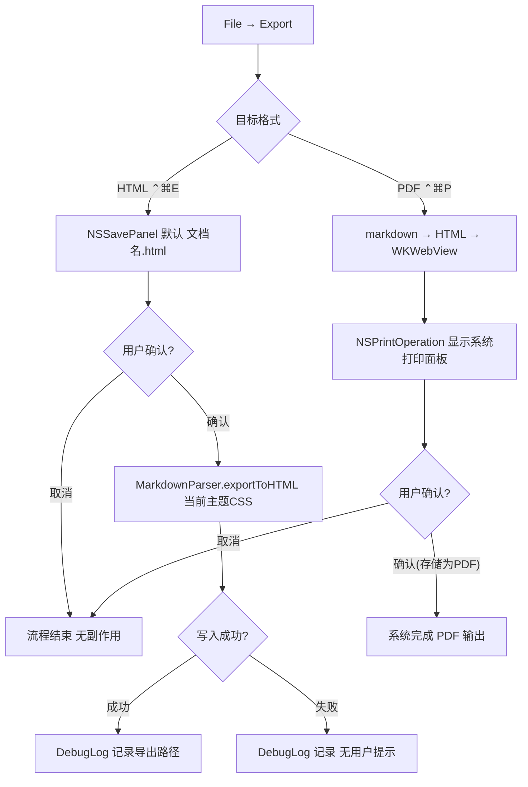

# PaperMD 用户旅程（USER_FLOW）

> 版本：v1.0　日期：2026-09-03
> 事实来源：`docs/01_reverse/REVERSE_ANALYSIS.md` ⑥（用户流程 1-6）与 ②（模块职责）；`docs/02_product/PRD.md` §3（场景）§7（业务流程）；`docs/product-review/USER_FLOW_REVIEW.md`（五要素走查与 UF 问题编号）
> 说明：旅程图自上述文档重组，源码行号沿用原引用；异常分支中属已知缺陷的均标注（UF 编号）。

---

## 旅程 1：开写 → 编辑 → 保存（新用户主旅程）



（源：REVERSE_ANALYSIS.md ⑥ 流程 1 原图；五要素走查见 USER_FLOW_REVIEW.md §二）

**旅程要点**：理论最快路径 = 双击 App → 立即可打字 → ⌘S（首存弹面板选目录）。已知边界：untitled 文档无自动保存/崩溃恢复，最长丢失窗口=整个写作会话（UF-01，B 级）。

## 旅程 2：打开已有文件 → 编辑 → 自动保存（回访用户主旅程）



（源：REVERSE_ANALYSIS.md ⑥ 流程 5 原图；空文档→欢迎文本分支补充自 USER_FLOW_REVIEW.md §三 UF-02 对 `Document.swift` L80-84/L167 的还原）

**旅程要点**（已知缺陷链，详见 `BUSINESS_FLOW.md`）：
- 解码失败分支 E→F2 构成「打开 → 看似正常（欢迎模板）→ 编辑 → 3 秒后覆盖写回原文件」的数据损失链（UF-02，B 级）。
- Open Recent 跨启动因无安全作用域书签而必然失败且仅日志（UF/PM-01，B 级）。
- 文件被外部修改无检测，自动保存静默覆盖（UF-03，B 级）。

## 旅程 3：插入图片 → 首次保存迁移（创作者旅程）

```mermaid
flowchart TD
    A[⌘V 粘贴] --> B{剪贴板含 PNG/TIFF 或图片文件?}
    B -- 否 --> C[纯文本粘贴: 替换选区 光标移末尾]
    B -- 是 --> D{文档已保存过?}
    D -- 是 --> E[目标: {文档名}.assets/ 不存在则创建]
    D -- 否 --> F[临时 tmp/PaperMD-UUID.assets 并记录 pendingAssetsURL]
    E --> G[生成文件名 image-时间戳-哈希.png]
    F --> G
    G --> H{写入磁盘成功?}
    H -- 失败 --> I[DebugLog 记录 不插入 回退普通粘贴路径返回 false]
    H -- 成功 --> J[插入  于选区处]
    J --> K[注册 undo 分组: 文本+文件成对撤销/重做]
    K --> L[首次保存时: 迁移临时资产并改写 ]
```

（源：REVERSE_ANALYSIS.md ⑥ 流程 3 原图；迁移失败风险见 USER_FLOW_REVIEW.md §四 UF-05——move 失败仍改写正文并无条件删除临时目录，文本与文件双失，B 级）

**旅程要点**：正常链路 ⌘V → `` 落盘 → ⌘S 首存 → 图片自动迁至 `{文档名}.assets/`；⚠ 已知缺陷：迁移非事务式（UF-05，B 级）；沙盒下同级建目录可达性【未知，需实测】（PM-02，C 级）。

## 旅程 4：查找替换（批量修改旅程）



（源：REVERSE_ANALYSIS.md ⑥ 流程 6 原图）

**旅程要点**（已知缺陷，V1 已在 `prototype/v1-new/` 呈现修复规格）：Replace All 不入撤销栈且破坏光标/视口（P4 B3）；无命中/正则非法静默（B5/B6）；面板每次 ⌘F 重建丢查询词+跨窗口错位（UF-06/IA-02，B 级）。

## 旅程 5：导出交付（HTML/PDF 旅程）



（源：REVERSE_ANALYSIS.md ⑥ 流程 4 原图）

**旅程要点**：成败均无用户提示（B5 第 1 点）；PDF 通道对远程图片静默缺图（网络禁令，UF-07/PM-03，C 级）；渲染完成与打印时序未等待【未知】。

## 旅程总览与缺口归档

| 旅程 | 触发 | 前置 | 主路径最短 | 结果反馈 | 异常分支 | 缺口归档 |
|------|:--:|:--:|:--:|:--:|:--:|------|
| 开写→编辑→保存 | ✔ | ✔ | ✔ | ✔ | ✘ | UF-01（PL-09） |
| 打开→编辑→自动保存 | ✔ | ✘ | ✔ | ✘ | ✘✘ | UF-02（PL-01）、UF-03（PL-05）、PM-01（PL-02） |
| 插图→首存迁移 | ✔ | ✘ | ✔ | ✘ | ✘ | UF-05（PL-08）、PM-02（PL-03） |
| 查找替换 | ✔ | ✘ | ✔ | ✘ | ✘ | UF-06（PL-06）+ P4 B2/B3/B6 |
| 导出 HTML/PDF | ✔ | ✘ | ✔ | ✘ | ✘ | UF-07（PL-10）+ P4 B5 |

（源：`docs/product-review/USER_FLOW_REVIEW.md` §八 流程五要素完整性总表，旅程 1/2 合并自原表前两行）
