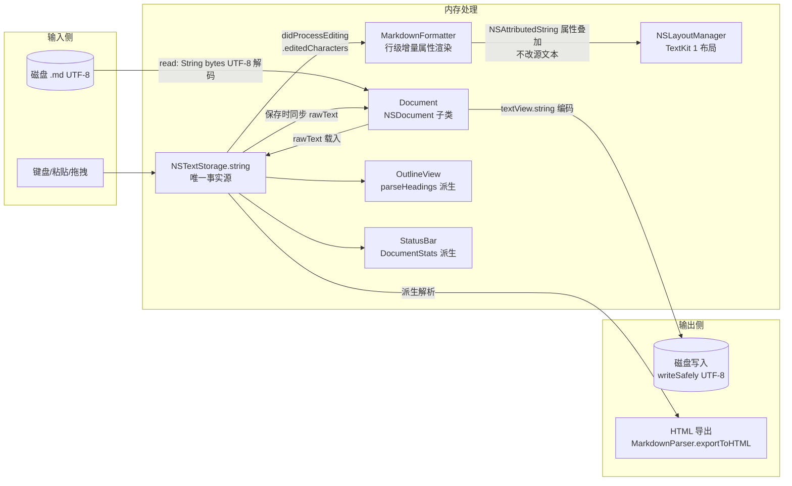
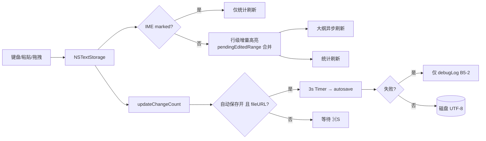
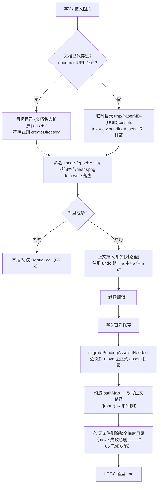
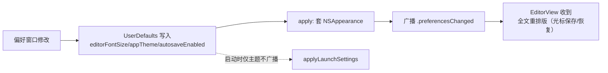

# PaperMD 数据流动（DATA_FLOW）

> 版本：v1.0　日期：2026-09-03
> 事实来源：`docs/08_development/DATA_MODEL.md` §3（写路径数据流）；`docs/04_architecture/STATE_MACHINE.md` §1（状态分布总图）；`docs/01_reverse/REVERSE_ANALYSIS.md` ②（模块职责与关键机制）、⑦（事实源规则）；`PaperMD/App/Document.swift`、`ImageHandler.swift`、`EditorView.swift`（经上述文档转引的行号）
> 说明：本文档描述**旧 App 当前实现**的数据流动；重写期目标态见 `docs/04_architecture/SYSTEM_ARCH.md` §1 分层图。

---

## 1. 文本主数据流（文件 → Document → TextKit → 渲染）

（源：STATE_MACHINE.md §1「文本事实源=NSTextStorage.string，其余皆派生」+ REVERSE_ANALYSIS.md ②模块职责表 + ⑦事实源规则；DATA_MODEL.md §1 不变量「磁盘内容恒等于 textView.string 的 UTF-8 编码；格式化属性永不写入文件」）

**三条铁律级规则**（源：REVERSE_ANALYSIS.md ⑦，原始出处 `CLAUDE.md` + `Document.swift`）：

1. 保存文件 = `textView.string`（纯 Markdown，`` 为纯文本）。
2. 格式化只改 NSAttributedString 属性，永不改源文本语义。
3. IME（hasMarkedText()）期间跳过格式化重建。

## 2. 写路径数据流（编辑 → 落盘）

（源：`docs/08_development/DATA_MODEL.md` §3 原图，原文件名 data-model.md）

## 3. 图片落地 assets 目录流（粘贴/拖拽 → 首存迁移）

（源：REVERSE_ANALYSIS.md ⑥ 流程 3 + ② ImageHandler 行；目录约定与命名规则见 `DATA_MODEL.md` §2.4：`ImageHandler.swift` L12、L69-80、L131-155、L203-234；⚠ 事务性缺陷见 `docs/03_flow/BUSINESS_FLOW.md` §2.3）

**图片流的撤销语义**：文本删除与文件删除成对注册（ImageInsertUndoHandler），⌘Z 时 `` 文本消失且 assets 中文件同被删除，⌘⇧Z 双双恢复（源：`ImageHandler.swift` L203-234，经 PRD §8 F011-图片撤销条转引）。

## 4. 派生数据流（大纲/统计/导出，单向不回流）

| 派生物 | 输入 | 计算者 | 时机 | 回写? |
|--------|------|--------|------|:-----:|
| 大纲标题树 | NSTextStorage.string | MarkdownParser.parseHeadings（ATX1-6 空标题过滤 + Setext1/2，level 钳制 ≤6） | 文本变化后 DispatchQueue.main.async 异步 | 否 |
| 统计三元组 | NSTextStorage.string | StatusBar.DocumentStats（词=空白切分非空片段；字符=text.count；阅读=max(1,words/200)） | 每次文本变化（含 IME 期） | 否 |
| 导出 HTML | textView.string | MarkdownParser.exportToHTML（processInline 转义 + wrapHTML 主题 CSS） | ⌃⌘E 确认时一次性 | 否 |
| 语法高亮属性 | 受影响行文本 | MarkdownFormatter（行级 + 代码块前向扩展 ≤100 行） | didProcessEditing（非 IME、非重入） | 仅属性，不改字符 |

（源：REVERSE_ANALYSIS.md ② 模块职责表；STATE_MACHINE.md §1「单一事实源 + 派生只读……大纲、统计、导出 HTML 全部从 NSTextStorage 派生，绝不反向写回」）

## 5. 偏好数据流（三键 UserDefaults）

（源：REVERSE_ANALYSIS.md ② 偏好行；`DATA_MODEL.md` §2.5；启动仅 applyLaunchSettings 避免就绪前重排版，`PreferencesWindowController.swift` L287-290）

## 6. 重写期数据流改造要点（承接既有决议，非本文新增）

- 分层规则：UI 不直接触文件系统；Parser/ListKit/Search 保持 Foundation-only；失败路径全部汇入 FeedbackCenter（B5）。（源：SYSTEM_ARCH.md §1）
- PersistenceStore.readUTF8 改 Result 化：解码失败返回 .decodeFailed 而非空串静默（B5-⑦，斩断 `BUSINESS_FLOW.md` §2.1 缺陷链的数据源）。（源：`docs/08_development/API_SPEC.md` §6）
- Replace All 禁止整串重置 `textView.string`，改 replaceCharacters + 撤销组（B3）。（源：API_SPEC.md §4）
