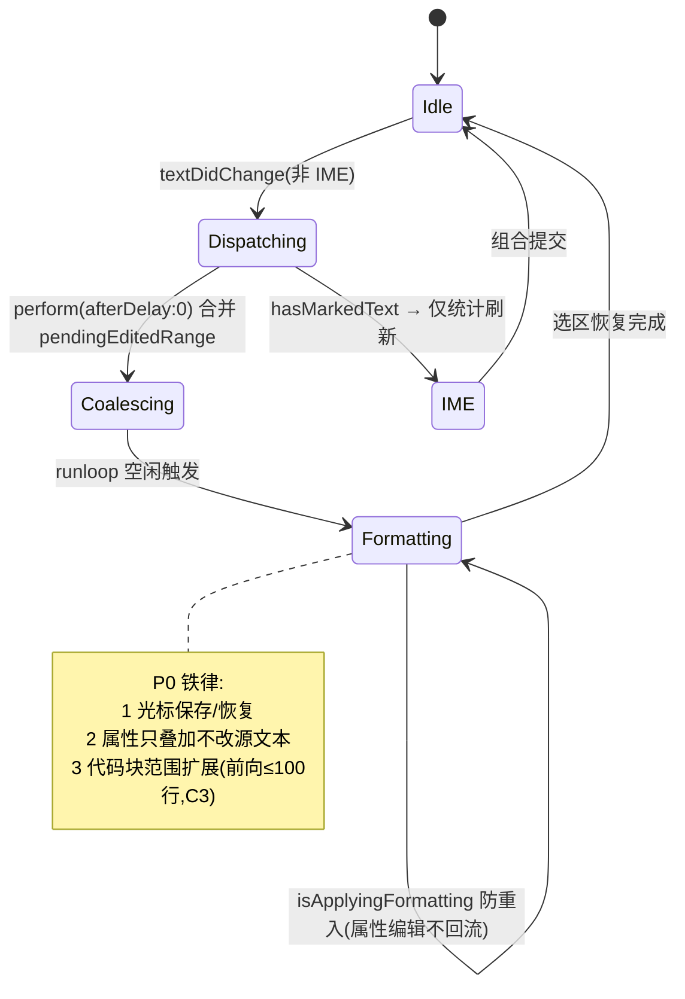

# PaperMD 重写状态管理设计（P7）

> 版本：v1.0　日期：2026-09-02
> 范围：NSDocument 体系、撤销栈设计、编辑调度状态机、UI 状态归口。事实源=旧源码；V1 变化标注 B 类。

---

## 1. 状态分布总图

| 状态域 | 载体 | 生命周期 | 同步方式 |
|--------|------|----------|----------|
| 文本事实源 | NSTextStorage.string | 文档级 | 唯一事实源，其余皆派生 |
| 文档脏态 | NSDocument.changeCount | 文档级 | updateChangeCount(.changeDone)；标题栏 ● |
| 撤销栈 | NSUndoManager（窗口级） | 窗口级 | beginUndoGrouping/registerUndo |
| 编辑调度 | EditorEngine（pendingEditedRange/isApplyingFormatting） | 视图级 | TextStorage delegate 回调 |
| IME 组合态 | textView.hasMarkedText() | 输入周期 | 系统查询 |
| 视图态 | focusMode/sidebarVisible | 窗口级 | EditorScene 布尔 |
| 偏好 | PreferencesStore(UserDefaults) | App 级 | 通知广播 `.preferencesChanged` |
| 查找会话 | FindSession【V1 B2/B6】 | 面板级 | 单例面板持有，目标随 keyWindow 重绑 |
| 反馈队列 | FeedbackCenter【V1 B5】 | App 级 | toast 队列/alert 模态 |

原则：**单一事实源 + 派生只读**。大纲、统计、导出 HTML 全部从 NSTextStorage 派生，绝不反向写回（旧项目即此纪律，重写维持）。

## 2. NSDocument 体系状态机

```mermaid
stateDiagram-v2
    [*] --> Untitled : ⌘N / 启动新建
    [*] --> Opened : ⌘O / Open Recent
    Untitled --> Edited : 首次输入
    Opened --> Edited : 输入(updateChangeCount)
    Edited --> Clean : ⌘S 成功 / 3s 自动保存成功
    Clean --> Edited : 再输入
    Untitled --> Clean : 首次保存(弹面板→迁移 pending 图片→落盘)
    Edited --> [*] : 关闭(三选:存储/不存储/取消)
    Opened -- 错误 : 解码失败→空文档兜底【V1:B5 呈现+禁自动保存】
```

关键约束（承接旧实现）：

1. `autosavesInPlace=true` 但 3 秒计时器由偏好开关控制（Document.swift L45、L188-206）；仅 fileURL 存在时启动。
2. `writeSafely` 前置图片迁移钩子（L144-158）：pending assets → `{文档名}.assets/` 并改写正文路径，然后才落盘。
3. 关最后窗口 App 驻留（`applicationShouldTerminateAfterLastWindowClosed=false`）；`ensureDocumentAndWindowVisible` 复用或新建 Document（AppDelegate L55-87）。
4. 窗口恢复禁用：encode/restoreState 空实现（Document L39-40）。

## 3. 撤销栈设计（NSUndoManager）

### 3.1 结构

- 归属：**窗口级** undoManager（textView.undoManager 回退 window.undoManager，MarkdownTextView.swift L59-65）。
- 注册路径：
  a. 普通编辑：NSTextView 原生 coalesce（打字合并）；
  b. 程序化编辑（格式化/查找替换/图片插入）：`replaceCharacters` 天然入栈 + 显式 `beginUndoGrouping/endUndoGrouping`；
  c. 文件副作用：`registerUndo(withTarget: ImageInsertUndoHandler)` 与文本编辑同组（ImageHandler L175-189）。

### 3.2 撤销组清单

| 组 | 边界 | 副作用回滚 | 事实/出处 |
|----|------|-----------|-----------|
| 打字 | 系统合并 | 无 | NSTextView 默认 |
| 包裹式格式化 | 单命令 | 无 | EditorView L487-542 |
| 行首替换（标题/引用） | 单命令 | 无 | EditorView L499-515 |
| 代码块包裹 | 单命令 | 无 | EditorView L517-525 |
| 图片插入 | begin/endUndoGrouping 包裹 replaceCharacters + registerUndo 文件删除 | **有**（文件成对删除/重写） | ImageHandler L165-192 |
| Replace 单处 | 单命令 | 无 | SearchReplaceController L114-138 |
| **Replace All【V1 B3】** | begin/endUndoGrouping 包裹整串 replaceCharacters（禁止 `textView.string =` 整体重置） | 无（纯文本） | product-review B3；旧版违规（L146-151） |

### 3.3 校验与恢复

- 菜单启停：canUndo/canRedo（Document.swift L361-367、MarkdownTextView L85-98）。
- ⌘Z/⇧⌘Z 拦截直调（performKeyEquivalent keyCode 6，MarkdownTextView L174-192）——保留（覆盖系统焦点竞争）。
- 重做对称性：每个 registerUndo 的 handler 内再注册反向（undoInsert↔redoInsert 成对注册，ImageHandler L218-233）。

## 4. 编辑调度状态机（EditorEngine 核心）



调度细节（承接 EditorView L281-323）：

- `cancelPreviousPerformRequests` + `perform(#selector, afterDelay: 0, inModes: [.common])` = 0 延迟 coalesce（同 runloop 多次编辑合并）。
- TextStorage `didProcessEditing` 过滤 `.editedCharacters` 且 `!isApplyingFormatting`（属性渲染不触发再调度）。
- 偏好变化/主题切换走**全量重排版**通道（reapplyFormatting，同样保存/恢复选区，L264-279）。

## 5. UI 状态归口

| 状态 | 存储 | 联动 |
|------|------|------|
| focusMode | EditorScene 布尔 | 0.25s 动画折叠侧栏→0、状态栏隐藏、工具栏隐藏（回调 onFocusModeChanged） |
| sidebarVisible | 独立于 focusMode（D5 混合态照旧） | splitView.setPosition(0/200) |
| 面板单例 | AppDelegate 持有（偏好/查找 isReleasedWhenClosed=false） | V1 修复：查找面板**不再每次重建**（旧版 if/else 双 new 缺陷，AppDelegate L362-366——P4 D1/P7 归位） |
| FindSession【V1】 | 面板单例内 | matchTotal/ordinal/wrapped/lastError 驱动状态行（B6）；⌘G/⇧⌘G/⌥⌘F 驱动面板（B2） |
| FeedbackCenter【V1】 | App 级队列 | 7 处旧静默失败入口统一汇入（B5）；toast 自动消退、alert 需确认 |

## 6. 并发与线程

- 全部编辑/渲染/保存触发在主线程（旧项目即如此；Document.autosave 经 `Task { @MainActor }` 显式回主线程，L197-203——保留该模式）。
- 大纲/统计刷新 `DispatchQueue.main.async` 异步化（避免同帧重排，EditorView L325-330）——保留。
- 【未知】大文档（10k+ 行）首次全量高亮耗时未基准化——TextKit 2 Spike（C5）的量化项之一。
