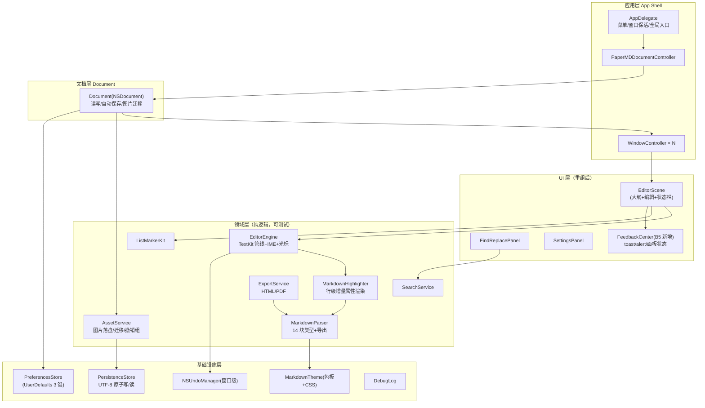

# PaperMD 重写技术架构（P7）

> 版本：v1.0　日期：2026-09-02
> 输入：docs/01_reverse/REVERSE_ANALYSIS.md（逆向事实）· docs/06_review/PRODUCT_REVIEW.md（A/B/C/D 分级）· docs/07_design_system/（DS）· docs/TEXTKIT2_SPIKE.md（历史评估）
> 性质：重写期架构蓝图。标注【建议，待用户确认】的选型未定案；禁止脑补——未验证处标【未知】。

---

## 1. 总体架构（分层）

分层规则：UI 不直接触文件系统；领域层不 import AppKit 视图类（Parser/ListKit/Search 保持 Foundation-only，沿用旧项目 Core/ 可测试性）；所有失败路径汇入 FeedbackCenter（B5）。

## 2. 技术选型建议【建议，待用户确认】

### 2.1 方案对比

| 方案 | 内容 | 优势 | 风险 | 结论 |
|------|------|------|------|------|
| A（推荐）| **延续 Swift + AppKit（编辑器 100% AppKit），非编辑界面可渐进 SwiftUI** | ① IME/光标/撤销三铁律的最短路径——AppKit NSTextView 二十余年输入系统成熟度；② 旧项目 MarkdownFormatter/Parser/Core 层可整体迁移（约 40% 代码免重写）；③ TextKit 1→2 可作为独立 Spike 解耦决策 | AppKit 样式代码量大；SwiftUI 混合边界需纪律 | 【建议，待用户确认】 |
| B | 全 SwiftUI（TextEditor 自研包装） | 声明式 UI 开发效率 | TextEditor 输入体验（IME/标记文本/selection 精度/性能）不达 P0 要求，需大量 NSTextView 桥接=隐性方案 A + 额外抽象税 | 不建议 |
| C | 跨平台（Electron/Tauri/Flutter） | 跨端 | 违背"原生 macOS"产品主张（README 核心特性 1）；IME 与文件即文档模型均需重造 | 排除（CLAUDE.md Out of scope 精神） |

选 A 的判定依据：CLAUDE.md "no SwiftUI in editor"、"Core Philosophy" P0 三条全部押注 AppKit 输入栈；逆向报告 ⑧ 证实零第三方依赖的稳定性。

### 2.2 最低系统与工具链【建议，待用户确认】

- macOS 13+（旧版 12.0；上调理由：Settings 措辞 D2、NSPopUpButton→SwiftUI Picker 混合便利；若需保 12 则沿用 Preferences 标题）。
- Swift 5.9+/Swift 6 渐进（并发标注先行：Document.autosave 的 Task @MainActor 模式保留）。
- 无第三方运行时依赖（延续零依赖）；测试 XCTest + XCUITest 保留全部 13+5 文件资产。

## 3. TextKit 2 迁移评估（C5，引 TEXTKIT2_SPIKE.md）

| 项 | 结论 |
|----|------|
| 现状 | TextKit 1 手工管线（EditorView.swift L52-70：NSTextStorage+NSLayoutManager+NSTextContainer） |
| TextKit 2 收益 | 长文档布局性能（按需 NSTextViewport）；结构化渲染控制（NSTextContentStorage 委托天然适配行级高亮） |
| TextKit 2 风险 | NSTextLocation 抽象使 NSRange 直觉失效（正是旧项目 UTF-16/Character 混用隐患的高发区 C6）；IME marked text 与自定义 layout 的交互面变化【未知——Spike 前无法量化】 |
| 建议 | 维持 SPIKE 文档判定：**v1 重写仍 TextKit 1**，把"引擎接口化"（见 api-design.md `EditorEngine`）作为前置——迁移时仅替换引擎实现，UI/领域层不动。Spike 门槛照抄：2 周、10k 行延迟基准、IME+undo 全量回归、零 P0 回归才迁 |
| 决策归属 | 用户（product-review C5） |

## 4. 关键机制承接表（旧→新）

| 旧机制 | 位置 | 新架构归位 | 备注 |
|--------|------|-----------|------|
| fixMenuStructure 程序化菜单 | AppDelegate L89-305 | App Shell（配置驱动，见 module-split CF-05） | 移除 Main.storyboard（C7 后）后成为唯一菜单源 |
| 0 延迟 coalesce 格式化 | EditorView L281-323 | EditorEngine 调度器 | 保留 pendingEditedRange 合并语义 |
| IME 跳过重排 | EditorView L223-226 | EditorEngine | P0 铁律 3 |
| 光标保存恢复 | EditorView L267-302 | EditorEngine | P0 铁律 2 |
| 图片撤销组 | ImageHandler L203-234 | AssetService（保留 ImageInsertUndoHandler 模式） | B3 将 Replace All 纳入同模式文本级撤销组 |
| 3 秒自动保存 | Document L188-206 | Document + PersistenceStore | 失败路径改走 FeedbackCenter（B5） |
| 主题三端联动 | Preferences.apply + MarkdownTheme | PreferencesStore + Theme | F050 |
| 三处重复的格式化实现 | EditorView/Document/MenuActions | EditorEngine.formatting 统一实现（D1 归位） | 消除行为漂移 |

## 5. 性能与安全

- 性能预算（承接 CLAUDE.md）：输入零卡顿；行级增量 O(受影响行)；代码块扩展回溯上限 100 行（C3 待决策）；大纲/统计异步。
- 安全：App Sandbox 维持（用户选择文件读写、网络关闭）；导出 HTML 全量转义（escapeHTML）防注入；无网络面=无传输攻击面。
- 崩溃面收敛：解码失败不再静默（B5）；writeSafely 原子写维持；撤销栈内存上限（原型 200 快照；App 沿用 NSUndoManager 分组原语，不快照全文）。

## 6. 演进路线

1. M1 骨架：App Shell + EditorEngine(TextKit 1) + Parser/Highlighter 迁移 + 全量单测搬运。
2. M2 B 类落地：FeedbackCenter、FindPanel 联动（B2/B3/B6）、H4-H6 入口（B1）、表格高亮（B4）。
3. M3 交付链：ExportService + AssetService + 自动保存。
4. M4（可选，C5 通过后）：TextKit 2 引擎替换 Spike。
