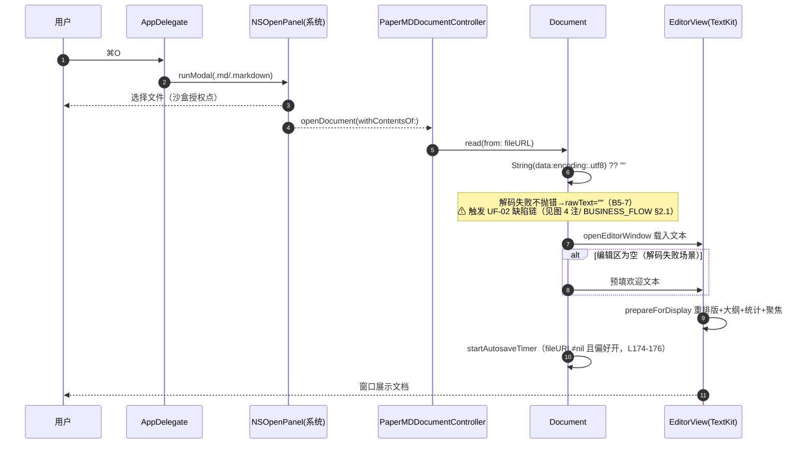
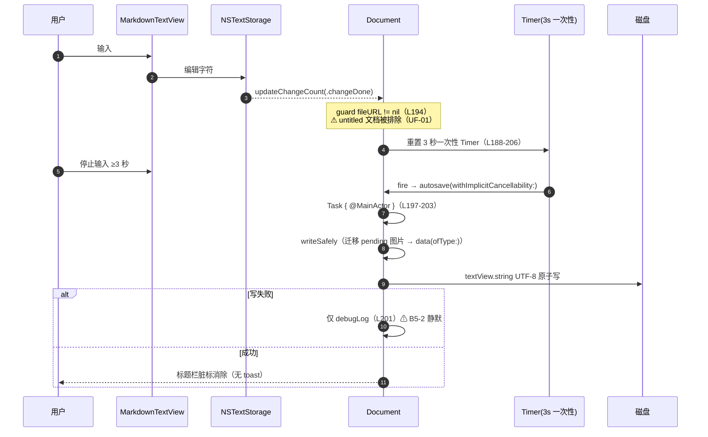
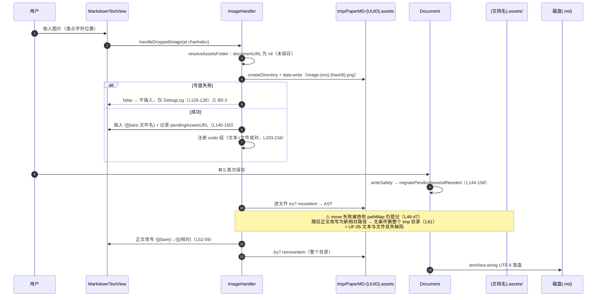
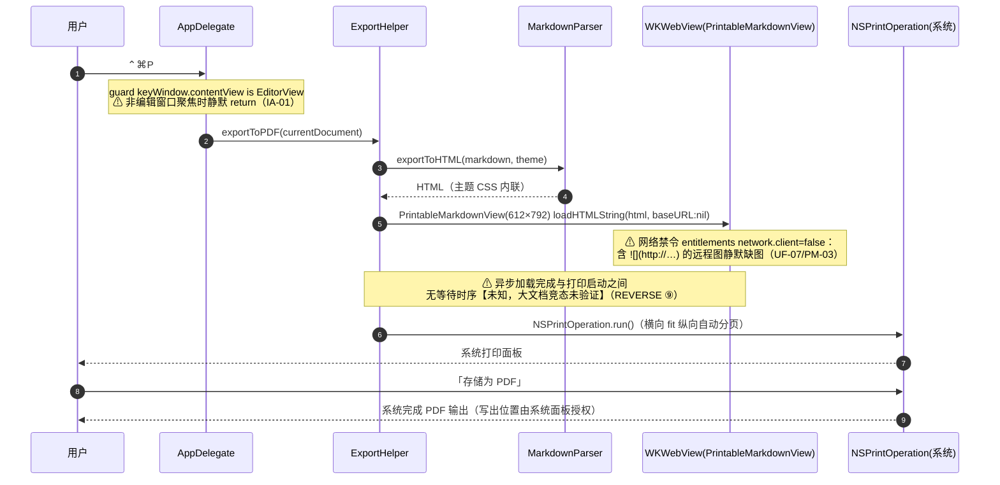
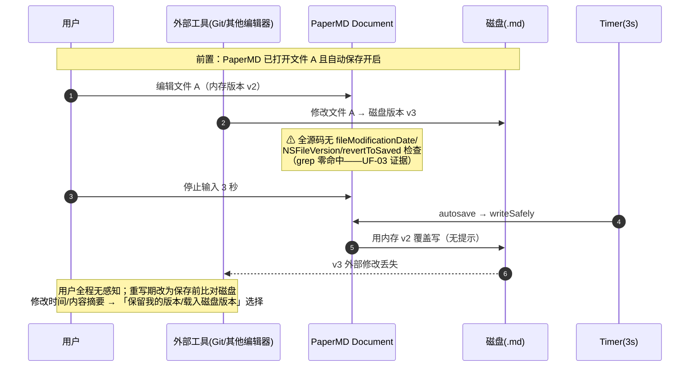
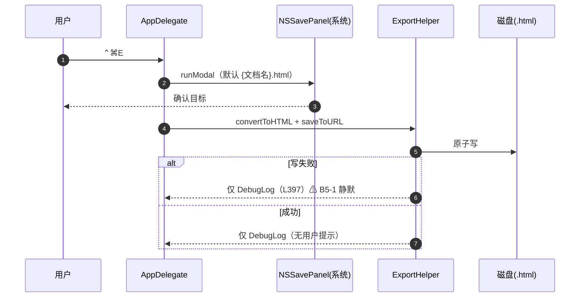

# PaperMD 时序图集（SEQUENCE_DIAGRAMS）

> 版本：v1.0　日期：2026-09-03
> 事实来源：`docs/01_reverse/REVERSE_ANALYSIS.md` ②⑥⑨（模块职责/用户流程/未完成能力）；`docs/product-review/USER_FLOW_REVIEW.md`（UF-02/UF-03/UF-05/UF-07 源码还原）；`docs/06_review/PRODUCT_REVIEW.md` B5 清单；`PaperMD/App/{Document,AppDelegate,ImageHandler,ExportHelper,MarkdownTextView}.swift`（经上述文档转引的行号）
> 说明：共 5 张 sequenceDiagram，全部基于旧 App 现实现；已知缺陷在图内以注记标出（编号可回溯）。

---

## 图 1：打开文档（⌘O / Open Recent）

（源：REVERSE_ANALYSIS.md ⑥ 流程 5；USER_FLOW_REVIEW.md §三）

## 图 2：自动保存（编辑静默 3 秒）

（源：USER_FLOW_REVIEW.md §二/§三；STATE_MACHINE.md §6 并发注记）

## 图 3：图片拖入 → 首存迁移（资产管线全链）

（源：REVERSE_ANALYSIS.md ⑥ 流程 3 + ② ImageHandler 行；USER_FLOW_REVIEW.md §四 UF-05）

## 图 4：导出 PDF（⌃⌘P 打印管线）

（源：REVERSE_ANALYSIS.md ⑥ 流程 4、⑧；USER_FLOW_REVIEW.md §六 UF-07；`ExportHelper.swift` L38-62）

## 图 5：外部修改冲突路径（现状=静默覆盖，已知缺陷 UF-03）

（源：USER_FLOW_REVIEW.md §三 UF-03 源码还原；该图为已知缺陷路径的时序化呈现，非推荐行为）

---

## 附：HTML 导出时序（补充，供对照图 4）

（源：REVERSE_ANALYSIS.md ⑥ 流程 4；`docs/06_review/PRODUCT_REVIEW.md` B5 第 1 点）
