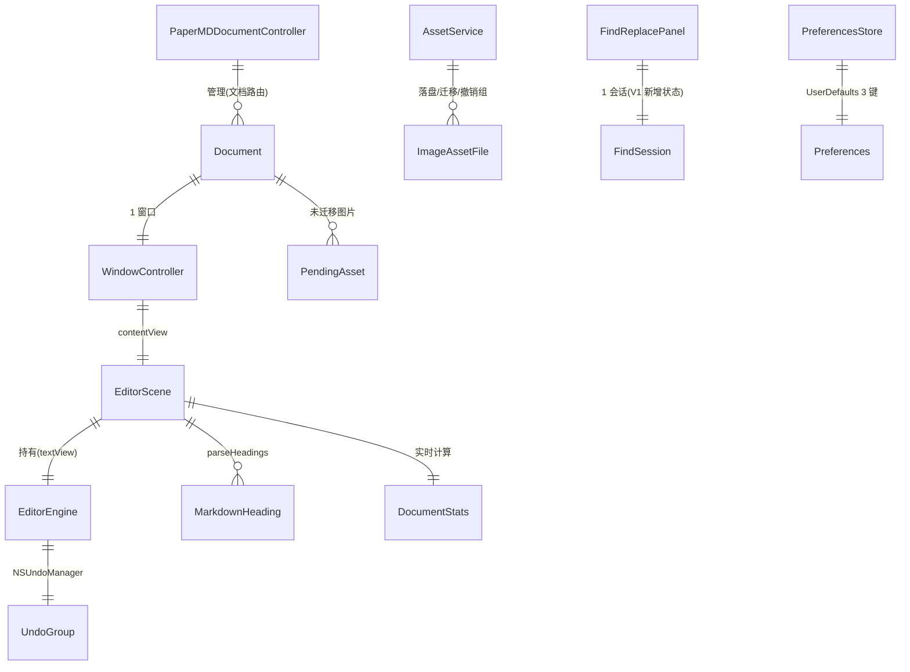
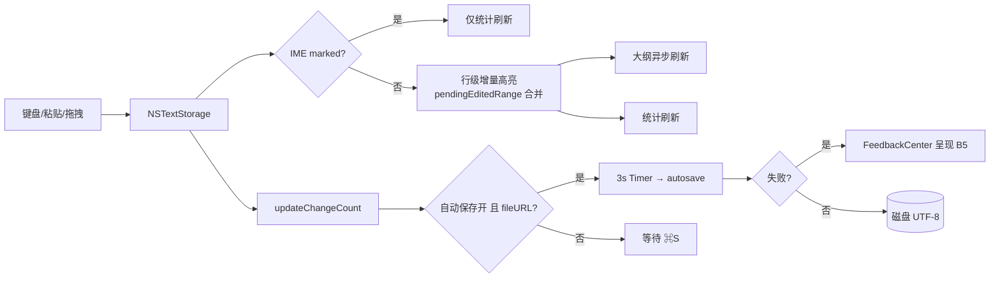

# PaperMD 重写数据模型（P7）

> 版本：v1.0　日期：2026-09-02
> 对齐：docs/01_reverse/REVERSE_ANALYSIS.md ⑦（逆向实体）+ P4 公共能力四层。全部字段来自旧源码事实；新增字段（B 类）单独标注。

---

## 1. 实体总览（ER）

## 2. 实体定义

### 2.1 Document（NSDocument 子类，对齐 Document.swift）

| 字段 | 类型 | 事实源 | 说明 |
|------|------|--------|------|
| rawText | String | Document.swift L21 | 保存用事实源（保存前同步 textView.string） |
| textView | weak NSTextView | L24 | 编辑器实时文本（唯一事实源=NSTextStorage.string） |
| autosaveTimer | Timer?（3 秒一次性） | L36 | 偏好开启且 fileURL 存在时启用 |
| fileURL / displayName / windowControllers | NSDocument 继承 | 系统 | — |
| **documentError【V1 B5 新增】** | enum?（.decodeFailed/.writeFailed） | product-review B5 | 打开/写失败原因，供 FeedbackCenter 呈现；decodeFailed 时禁用自动保存计时（防空串覆盖） |

不变量：磁盘内容恒等于 `textView.string` 的 UTF-8 编码；格式化属性永不写入文件。

### 2.2 文本结构值类型（对齐 Core/MarkdownParser.swift）

| 类型 | 字段 | 事实源 |
|------|------|--------|
| MarkdownLine | index:Int / text:String / kind:MarkdownBlockKind（14 种：blank/paragraph/atxHeading(level)/setextHeading(level)/blockquote/codeFence/codeContent/unorderedList/orderedList/taskList(checked)/horizontalRule/imageLine/tableRow/tableSeparator） | MarkdownParser.swift L8-29 |
| MarkdownHeading | level:Int(1-6，钳制) / title:String / lineNumber:Int | L31-35 |
| ListMarkerType | bullet / numbered / task(isChecked) | ListMarkerDetector.swift L8-12 |

> A2 勘误的模型化修复：`ListMarkerDetector.marker` 重写为"marker 前缀识别与内容可为空"（`^(\s*)([-*+]|\d+\.)(\s+)?$` 命中空内容），使 F044/F046 分支可达——属 C6 重写策略的具体输入。

### 2.3 统计（对齐 StatusBar.DocumentStats）

| 字段 | 计算 | 事实源 |
|------|------|--------|
| wordCount | 按空白切分非空片段数 | StatusBar.swift L122 |
| characterCount | text.count（Character 数） | L119 |
| readingTime | **V1：words==0 ? 0 : max(1, words/200)**（B7 修复；旧版恒 max(1,·)） | L115/L126 |

### 2.4 图片资产（对齐 ImageHandler.swift）

| 项 | 规则 | 事实源 |
|----|------|--------|
| 文件名 | `image-{epochMillis}-{data 前 8 字节大整数}.png` | L76-80 |
| 已保存文档目录 | `{文档名去扩展}.assets/`（同目录） | L69-74 |
| 未保存文档目录 | `tmp/PaperMD-{UUID}.assets`（textView.pendingAssetsURL 挂载） | L140-150 |
| 兜底目录 | `tmp/PaperMD.assets` | L12、L152 |
| 正文引用 | `` 纯文本；首存迁移改写 bare→相对 | L52-59 |
| 撤销组 | 文本删除+文件删除成对；重做反向 | L203-234 |

### 2.5 偏好（对齐 Preferences/UserDefaults）

| 键 | 类型/默认 | 事实源 |
|----|-----------|--------|
| editorFontSize | Int / 16（档位 12-24 十档） | PreferencesWindowController L136、L271-280 |
| appTheme | String(light/dark/system) / system | L252-260 |
| autosaveEnabled | Bool / true | L262-269 |

派生：apply()=套 NSAppearance+广播 `.preferencesChanged`；applyLaunchSettings()=仅主题不广播（避免就绪前重排版，L287-290）。

### 2.6 FindSession【V1 新增（B2/B3/B6）】

| 字段 | 类型 | 说明 |
|------|------|------|
| query / replacement | String | 面板输入 |
| useRegex | Bool | 正则模式 |
| matchTotal / currentOrdinal | Int | B6 计数态 |
| wrapped | Bool | 回绕提示 |
| lastError | enum?（.invalidRegex/.noMatch） | 旧版静默→V1 面板状态行 |

### 2.7 UndoGroup（撤销栈语义，对齐 NSUndoManager 用法）

| 组类型 | 内容 | 事实源 |
|--------|------|--------|
| 打字 coalesce | 系统按 typing 周期合并 | NSTextView 默认 |
| 格式化命令 | 单命令一组（wrap/heading/quote/codeblock/link） | EditorView 各 apply |
| 图片插入 | 文本+文件成对（ImageInsertUndoHandler） | ImageHandler L203-234 |
| **Replace All【V1 B3 新增】** | 整体一组，撤销/重做恢复全串与选区 | product-review B3（旧版违规点修复） |

## 3. 数据流（写路径）

## 4. 持久化与迁移

- 无数据库、无私有格式：文件即文档（.md/.markdown，UTI net.textility.markdown）。
- UserDefaults 仅 3 键（§2.5）；重写期保持键名兼容（用户偏好无损升级）。
- 窗口恢复禁用维持（NSDisableWindowRestoration）。
